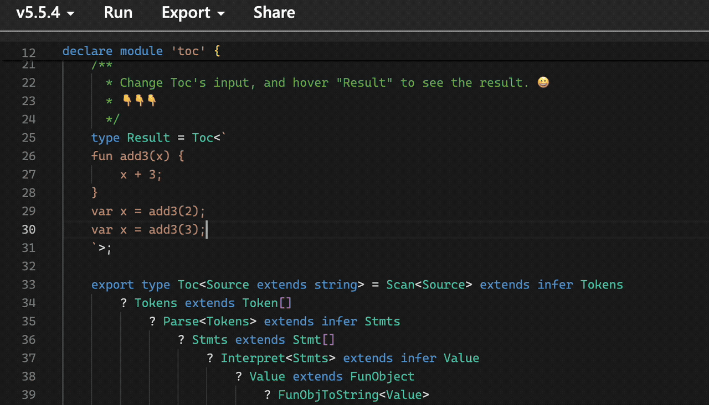

# Type gymnastics: Implementing a C-style language interpreter



- [Type gymnastics: Implementing a C-style language interpreter](#type-gymnastics-implementing-a-c-style-language-interpreter)
  - [1. What kind of functional language is the type system of ts?](#1-what-kind-of-functional-language-is-the-type-system-of-ts)
    - [1.1 Types and values](#11-types-and-values)
    - [1.2 Variables](#12-variables)
    - [1.3 Conditions](#13-conditions)
      - [1.3.1 Assignability](#131-assignability)
      - [1.3.2 Pattern matching](#132-pattern-matching)
      - [1.3.3 Local constants](#133-local-constants)
    - [1.4 Functions](#14-functions)
      - [1.4.1 Generics](#141-generics)
      - [1.4.2 Type tools - Functions](#142-type-tools---functions)
      - [1.4.3 Recursion](#143-recursion)
      - [1.4.4 Loop \<=\> Recursion](#144-loop--recursion)
      - [1.4.5 Tail recursion](#145-tail-recursion)
      - [1.4.6 First-Class-Function](#146-first-class-function)
  - [2. How to implement a Toc interpreter?](#2-how-to-implement-a-toc-interpreter)
    - [2.1 Arithmetic operations and size comparisons](#21-arithmetic-operations-and-size-comparisons)
    - [2.2 Interpreter](#22-interpreter)
      - [2.2.1 Syntax of Toc](#221-syntax-of-toc)
      - [2.2.2 Lexical Analysis](#222-lexical-analysis)
        - [2.2.2.1 Tokenization (ts version)](#2221-tokenization-ts-version)
        - [2.2.2.2 Tokenization (type version)](#2222-tokenization-type-version)
      - [2.2.3 Syntax Analysis](#223-syntax-analysis)
        - [2.2.3.1 Recursive Descent](#2231-recursive-descent)
        - [2.2.3.2 Complete Expression Syntax Analysis (ts version)](#2232-complete-expression-syntax-analysis-ts-version)
        - [2.2.3.3 Complete Expression Syntax Analysis (type version)](#2233-complete-expression-syntax-analysis-type-version)
      - [2.2.4 Execution](#224-execution)
        - [2.2.4.1 Visitor Pattern and ts-Interpreter](#2241-visitor-pattern-and-ts-interpreter)
        - [2.2.4.2 type-Interpreter](#2242-type-interpreter)
      - [2.2.5 Statements](#225-statements)
        - [2.2.5.1 Expression Statements](#2251-expression-statements)
        - [2.2.5.2 var Statements](#2252-var-statements)
        - [2.2.5.3 Environment](#2253-environment)
        - [2.2.5.4 Variable Expressions and Assignment Expressions](#2254-variable-expressions-and-assignment-expressions)
        - [2.2.5.5 Scope](#2255-scope)
        - [2.2.5.6 Block statement](#2256-block-statement)
        - [2.2.5.7 If statement](#2257-if-statement)
        - [2.2.5.8 For statement](#2258-for-statement)
      - [2.2.6 Function](#226-function)
        - [2.2.6.1 Function statement](#2261-function-statement)
        - [2.2.6.2 Call expression](#2262-call-expression)
      - [2.2.7 Unfinished business](#227-unfinished-business)
  - [3. Summary](#3-summary)
  - [4. References](#4-references)


TypeScript is a superset of JavaScript, primarily adding static type checking to JavaScript while being fully compatible with it. At runtime, types are completely erased. Because of this, the TypeScript type system is extremely powerful, allowing for more type hints and error checking while maintaining the dynamic nature of JavaScript and enabling rapid development.

> For simplicity, we will use abbreviations like ts and js to refer to TypeScript and JavaScript.

Does dynamicity and static checking seem to be in conflict? However, the ts team and community have provided a way to balance both. That is, when the ts compiler cannot make an inference, it allows the developer to tell ts how to infer. The type description that informs ts (simply put, it describes what the output type should be based on different input types) is consistent with the corresponding js code logic (since considering types often simplifies things). Therefore, ts's type system must be powerful enough[to be Turing complete.](https://github.com/microsoft/TypeScript/issues/14833)to be competent.

The type system of ts is a functional programming language. Type gymnastics refers to using this programming language to play tricks. What we are going to play today is to use it to implement an interpreter for another language (I named this language[Toc](https://github.com/huanguolin/Toc)) (If you want to experience this interpreter, please go to[Toc](https://github.com/huanguolin/Toc)the repository, it's easy to find the entrance 😊).`Toc` The language is `C` style syntax, close to `js`. Dynamic typing, with basic types including numbers, booleans, strings, and `null`, supporting variables, expressions, block statements,`if-else` conditional statements,`for` loop statements, and functions. Functions are first-class citizens, can be passed in and out, and support closures. For more detailed syntax, please refer to [Toc Grammar Spec](https://github.com/huanguolin/toc/blob/main/docs/grammar.md)。

If you are not very familiar with the type system of TypeScript, that's okay. 😊 We are not going to jump straight into implementation; let's do some warm-up exercises first—let's take a look at what the TypeScript type system provides and what its limitations are. Therefore, this article is divided into two parts:

1. How is the type system of TypeScript a functional language?
2. How to implement a Toc interpreter?

If the first part is not novel to you, you can skip directly to the second part.

## 1. What kind of functional language is the type system of ts?

When it comes to programming languages, we think of at least including features like variables, conditions, loops, and functions; otherwise, it cannot be used (of course, I am talking about normal programming languages, not something like [Ook!](https://code.tutsplus.com/articles/10-most-bizarre-programming-languages-ever-created--net-2412) this). However, before I talk about variables, conditions, loops, and functions, I need to mention something more fundamental.

### 1.1 Types and values

Types are collections that describe values, for example, `number` represents all numbers.`1` is `number` a value of. `1` It can also be a type, which describes a collection that contains only one value. TypeScript allows us to make such precise type descriptions. Therefore, it also provides union types ([union](https://www.typescriptlang.org/docs/handbook/2/everyday-types.html#union-types)）, tuple([tuple](https://www.typescriptlang.org/docs/handbook/2/objects.html#tuple-types)) and so on.

```ts
type A = 1;

// union
type B = 'red' | 'green' | 'blue';

// tuple
type C = [B, number]; // ['red' | 'green' | 'blue', number]
```

> Click[here](https://www.typescriptlang.org/play?#code/C4TwDgpgBAglC8UCMBuAUGg9JqBXAdgJYD2+aokUAQglAOQBOEAJnVAD70DmTE+bnOgCMANrgh10WHMFxgREcuGgBhWgG0qAGij5cAWyEQGAXRRRsUdYxYDuvfh3qjxdHXsPGTQA), experience online.

Of course, it also provides the whole set and the empty set:`any` and `never`.
&#x20;Now let's return to variables, conditions, loops, and functions.

### 1.2 Variables

Well, in fact, the type system of ts does not provide variables; it only provides constants, which is very functional. But that's enough; if you are familiar with other functional programming languages, you will understand.

```ts
type A = 2;
type B = string | A; // string | 2
```

> Click[here](https://www.typescriptlang.org/play?#code/C4TwDgpgBAglC8UBMBuAUKSUBCCoGdgAnASwDsBzKAH1hSgHoGDjyrakg), experience online.

Is that all? Well, this is a global constant. In fact, there is also a local constant, which I will explain when we talk about conditions. Also, I mentioned that there are functions, and the parameters of functions are also a kind of constant. 😼

### 1.3 Conditions

```ts
type A = 2;
type B = A extends number ? true : false; // true
```

> Click[here](https://www.typescriptlang.org/play?#code/C4TwDgpgBAglC8UBMBuAUKSUBCDZQgA9gIA7AEwGcpSBXAWwCMIAnKAfimBdugC4oAMwCGAG0oQUUAPTSuPCEA), experience online.

Isn't it simple?

`A extends B ? C : D` This form expresses `A` can be assigned to `B`, then the result is `C`, otherwise it is `D`。Assignability is a key concept in TypeScript, and I will explain it below.

#### 1.3.1 Assignability

TypeScript adopts a structural type system ([Structural Type System](https://www.typescriptlang.org/docs/handbook/typescript-in-5-minutes.html#structural-type-system), also known as[Duck typing](https://en.wikipedia.org/wiki/Duck_typing)）。That is to say, TypeScript determines what type you are based on what you have, or whether the structure conforms to a certain type definition. As long as it conforms to a certain type definition structure, it is acceptable, without needing to specify a type at the time of definition like `java` or `c#` that, which must be specified as a certain type at the time of definition.

```ts
type Cat = {
    eat: (food: string) => void;
};
type HuntDog = {
    eat: (food: string) => void;
    hunt: () => string;
};

type IsCat = HuntDog extends Cat ? true : false; // true

let cat: Cat = {
    eat: (food: string) => console.log(`eat ${food}`)
};
let hDog = {
    eat: (food: string) => console.log(`eat ${food}`),
    hunt: () => 'animal',
};

let hDog2: HuntDog = hDog; // ok
cat = hDog; // ok
hDog2 = cat; // error: Property 'hunt' is missing in type 'Cat' but required in type 'HuntDog'
```

> Click[here](https://www.typescriptlang.org/play?#code/C4TwDgpgBAwghsKBeKBvAUFLUIIFxQAUAZgPakAmBAzsAE4CWAdgOYCUyAfFAG6kMUA3OgC+w0JCgAJAK5NgAEVItkaTNlzACJclSi1GrDkm58Bw7FAAWcrUWPcDzFsLHp0E6AElq8RCll5JRUIAA9gCCYKalgEKAB+KHoZaAJiOAAbaghBKAB6PKS6FPcMiEQAY3xY-zVLTW0yShp6ZwcoCtImalIygDoM5UIAA00oABJUJooRYbZRYTLEK2DVDHrqnWb9VqMuDq6e-sGWEbHJ6dm2ABp1LBt5bXaAcjgmBgBbTOfbt3Ql6zBABMBECimUqhWylyBSgpAA1ugqrUoS58oUEehUUDVMiYYUIHQ6KQ6AQAArEyB0UBQZ4PYDPKAMGIfZnUZxMphJcDQZ5+RkAIxkiDoEAAjjIGKKKJzuZJnmDgs8gA), experience online.

Returning to `A extends B ? C : D` , as long as type A conforms to the definition of type B, or type A is a subset of type B (of course, any set is a subset of itself), the condition holds; otherwise, it does not hold. In this form, there is also a syntax that can be regarded as pattern matching.

#### 1.3.2 Pattern matching

```ts
type A = Promise<string>;
type B = A extends Promise<infer C> ? C : never; // string

type T = [string, 1, null, A];
type R = T extends [string, ...infer Rest] ? Rest : never; // [1, null, A]
```

> Click[here](https://www.typescriptlang.org/play?#code/C4TwDgpgBAglC8UAKAnA9gWwJYGcIB4dgUsA7AcwD4BuAKFEigCEFYoIAPYCUgEx2TpsefGQBmEFFADClKAH4ZUAFxRSEAG6TqUAPS6oREhVr1w0ACqsA2kbLkANFACMT0gFcANp6cwAunQM0ABKrFac3HwCtsT2TgB0ieKSUMEQRH4KqenAKmqa2noG1q5qXj6wfkA), experience online.

This syntax can identify `extends` whether the left side conforms to the type structure on the right side; if it conforms, a certain part can be inferred.

#### 1.3.3 Local constants

In the above example `C` and `Rest` is the local constant. With this, I can change the variable name locally at any time:

```ts
type T = [string, 1, null, undefined];
type R = T extends [string, ...infer Rest]
    ? Rest extends [1, ...infer Rest]
        ? Rest extends [null, infer Rest] // 旧名字，在新的作用域下代表的值变化了
            ? Rest extends infer Last // 换名字，好无聊🥱，别担心，后面会用上的
                ? Last
                : never
            : never
        : never
    : never;
// undefined
```

> Click[here](https://www.typescriptlang.org/play?#code/C4TwDgpgBAKlC8UDaBnYAnAlgOwOYBooBGQ7AVwBsLCzsATCAMxwjoF0BuAKFEigCUEsKBAAewCPRTI0WPIQB0SnIwjoBENGy5RdUAPwa0I8ZLrSkJKEoUq1R4Nr3ODDkxKnJyVQnfX9NRygAemCoQHPTQFgVQHVtQBh-wAp1QAbTQBC3QB15QApXQH31QGg5QGO5QAsI5MAeBUAN5UA0ZUAwuR0XGsMA4zEPcyg-KAAZAENjUKhAI2MY2MBfTUAD00ApAMA+DcBHXdjAaiVAUaNAYf1YwDgVQCN0wCx5dMAoOWTqmv3XTrQ9g5cALihsCAA3NRODi6vb9Hu9R5u753fn7h7aBmYVzoQA), experience online.

In [4.7](https://devblogs.microsoft.com/typescript/announcing-typescript-4-7/#extends-constraints-on-infer-type-variables), [4.8](https://devblogs.microsoft.com/typescript/announcing-typescript-4-8/#infer-types-template-strings) The two versions also have extensions and optimizations for this conditional expression, which will be discussed later.

### 1.4 Functions

Shouldn't we talk about loops? Uh... actually, there are no loops in the TypeScript type system 😓. But don't worry, there are alternatives. I think you can guess...&#x20;
&#x20;That's right, it's recursion! So we need to look at functions first.

#### 1.4.1 Generics

Before looking at functions, we need to look at generics. The TypeScript type system does not explicitly state 'we provide functions for type programming.' But its generics offer the same capability.

```ts
function flatten<T>(arr: (T | T[])[]): T[] {
    let result: T[] = [];
    for (let x of arr) {
        if (Array.isArray(x)) {
            result = result.concat(flatten(x));
        } else {
            result.push(x);
        }
    }
    return result;
}

console.log(flatten([1, 2, [3, 4], 5, [[6, 7], 8]])); // [1, 2, 3, 4, 5, 6, 7, 8]
console.log(flatten(['abc', ['123', ['456', '789']], 'def'])); // ["abc", "123", "456", "789", "def"]
```

> Click[here](https://www.typescriptlang.org/play?#code/GYVwdgxgLglg9mABMANgQylApmAPAFQD4AKNAJzIC5Fj9EAfRfAbQF0BKN96l1xAbwBQiEYhRYoiMlgDOIFFB5tEAXkRsA3MNHA4ZGuMkAPRHGCJyZdgO2jRMc8QCCFNAE8AdDBkuy74kbs1kJ2oaLScgqqUrLyUB4QCBAYxKgY2GABQVphIgC+iFgoMlg2uaERcR4ADiAyABZZObl5toitdtJQIGRIlQparYKJYDJw4h4ocADmqeiYOMTMAIwANIgATOvMAMzrACys6wCs28wAbOsA7EeIABysHOwaiAD0r+prm+t7iPsn60uiCu6wewwQYwmU1maQWmWYAHI0AAjCAI7YI5YbHbo9QI-bHc64hFXO4ATgRj3WCIAJlhgJTsm8PswAEQoiCs9asrE7LmIVkE8781mkskiunAVmsIA), experience online.

This is the conventional usage—generics make it easier for us to reuse algorithms (and type-safe). In the TypeScript type system, generics can be used to reuse type declarations of the same form. For example, `Promise<T>`They can also be used as utility types, and the official library provides several, [Utility Types](https://www.typescriptlang.org/docs/handbook/utility-types.html)such as: `Required<Type>, Pick<Type, Keys>`We can also implement some utility types ourselves, which can be used like functions.

#### 1.4.2 Type tools - Functions

```ts
type PromiseValue<T> = T extends PromiseLike<infer V> ? V : never;

type TestPV1 = PromiseValue<Promise<string>>; // string
type TestPV2 = PromiseValue<Promise<'r' | 'g' | 'b'>>; // 'r' | 'g' | 'b'


type First<T extends unknown[], Fallback = unknown> = T extends [infer F, ...infer rest] ? F : Fallback;

type TestF1 = First<['r' | 'g' | 'b', number]>; // 'r' | 'g' | 'b'
type TestF2 = First<[string[]]>; // string[]
type TestF3 = First<[]>; // unknown
type TestF4 = First<[], any>; // any
```

> Click[here](https://www.typescriptlang.org/play?#code/C4TwDgpgBACgTgewLYEsDOEBqBDANgVwgB4AVAPigF4oSoIAPYCAOwBM1ZFUMAZFAa2IpmAMwhwomCgH5JUAFxRmEAG7iA3AChNoSDQhpgMTAEYqnZOix5CReJYxFDcYQHMyZdVAD03qM7cdcGgSAyNMACZze25rAmIYqyIAcjhkqAAfKGTXdKzkgCNkjy9fbLTM7NzKwuTtIL0AMRQ4Q1I6RhZ2KHxmfmYEAHdmAG0AXQAaKEa8XALsAGN+c17+oeYKaloGJjYOEeExCUapgDpzw-EoODCxqFlGhWnZ+aWtBpCwxrNqZtbgIgjVJ5Kog2pTZj4JAFcRjTw+PzAmrVfJFD76QyNKK-FptEYBZiucZw0p+AlEsbo0KYgDM5j+eJJCJ6fQGwypXwALPTcQDxlNsMwQPCyoKQEA), experience online.

Here, the generic parameter is like a function parameter, and through `extends` we can constrain types, and generic parameters also support default values.

If we pass `PromiseValue<T>` to `Promise<Promise<number>>` the result is `Promise<number>`If at this point, we still want to obtain the innermost type, that is `number`What should we do? Then recursion should come into play.

#### 1.4.3 Recursion

```ts
type PromiseValue<T> = T extends PromiseLike<infer V> ? V : never;

type TestPV1 = PromiseValue<Promise<Promise<number>>>; // Promise<number>

type PromiseValueDeep<T> = T extends PromiseLike<infer V> ? PromiseValueDeep<V> : T;

type TestPVD1 = PromiseValueDeep<Promise<Promise<number>>>; // number
```

> Click[here](https://www.typescriptlang.org/play?#code/C4TwDgpgBACgTgewLYEsDOEBqBDANgVwgB4AVAPigF4oSoIAPYCAOwBM1ZFUMAZFAa2IpmAMwhwomCgH5JUAFxRmEAG7iA3AChNoSDQhpgMTAEYqnZOix5CReJYx2uVos3xIARuLI-1UAPT+FtzEbp7e2rrQ9iE4BBAAIhAQYKQU1LQMTGwcMVZ8gkTCYhJSULJ5GHGESSlEZYokWjrg0CQGRpgJZtSV1vG1qX1ODqHuXnA+ZH6BSuPiQA), experience online.

With recursion, we can talk about loops! 😄

#### 1.4.4 Loop <=> Recursion

As mentioned earlier, the TypeScript type system does not provide primitive loops. However, recursion can replace loops; they are equivalent. You heard it right, recursion and loops are equivalent! The two can be converted into each other. Let's take an example of concatenating an array of numbers into a string:

```ts
function join(arr: number[]): string {
    let result = '';
    for (let x of arr) {
        result += x;
    }
    return result;
}
console.log(join([1, 2, 3])); // '123'

type Join<Arr extends number[], Result extends string = ''> =
    Arr extends [infer F, ...infer Rest]
        ? F extends number
            ? Rest extends number[]
                ? Join<Rest, `${Result}${F}`>
                : never
            : never
        : Result;
type test = Join<[1, 2, 3]>; // '123'
```

> Click[here](https://www.typescriptlang.org/play?#code/GYVwdgxgLglg9mABAKzjMAKAhgJxwLkTBAFsAjAUxwG0BdASkIGcod0BzRAbwChF-EAGwpREOCkxCDRAXkQByeQG4+A4HByIMw0QA9EcYIlw563VQIHjJ0xAGo5ulZYC+FsSJA4k1qVBVuEAhMcMIAdIJw7Bio6BjUAIwANIgATCkAzAz0SogA9HkKCakZ8jw8UACeAA4UiABSaGAAPACCeIgUulAUYAAmTESklDS0KQBKEn6d3b0DiCxsYJxyigB8iDLu7ZpdPf2D1OjAVIgAYilhV8enkyy07pYA-Ocz+-PE5FSPlgIvd6I9nNBp8RnQfr9fi9GuhmgCUgADAAkXDufhcKLOLgRawhkIEhDAFAAbt98b9CSSyfjCGjpCoqrVED0WJsGk1mokUulEFk1rkCkUSvIgA), experience online.

The code implemented above using loops can also be done with recursion. It's just that our type version `Join` seems a bit verbose (with two extra checks 😔). However, in [4.7](https://devblogs.microsoft.com/typescript/announcing-typescript-4-7/#extends-constraints-on-infer-type-variables) the version with improvements, the syntax here can be changed to:

```ts
function join(arr: number[]): string {
    let result = '';
    for (let x of arr) {
        result += x;
    }
    return result;
}
console.log(join([1, 2, 3])); // '123'

type Join<Arr extends number[], Result extends string = ''> =
    Arr extends [infer F extends number, ...infer Rest extends number[]]
        ? Join<Rest, `${Result}${F}`>
        : Result;
type test = Join<[1, 2, 3]>; // '123'
```

> Click[here](https://www.typescriptlang.org/play?#code/GYVwdgxgLglg9mABAKzjMAKAhgJxwLkTBAFsAjAUxwG0BdASkIGcod0BzRAbwChF-EAGwpREOCkxCDRAXkQByeQG4+A4HByIMw0QA9EcYIlw563VQIHjJ0xAGo5ulZYC+FsSJA4k1qVBVuEAhMcMIAdIJw7Bio6BjUAIwANIgATCkAzAz0SogA9HkKCakZ8jw8UACeAA4UiABSaGAAPACCeIgUulAUYAAmTESklDS0KQBKEn6d3b0DiCxsYJxyigB8iDLu7ZpdPf2D1OjAVIgAYjP788TkVClhD8enkyyXc4M3I3S07pYA-A0ms0XlAUgADAAkXBefhcULOLjBa1+AkIMOkKiqtUQPVecka6GaiRS6UQWTWuQKRRK8iAA), experience online.

Now it looks much more concise, and the comparison of the code between the two conversions is also easier to see. From loop to recursion:

> Loop termination condition -> Recursion termination condition
> Loop accumulation variable result -> Recursion function "accumulation" parameter Result
> Loop moving variable x -> Recursion function "moving" parameter Arr

In pure functional programming languages, there are no loops; recursion is the only alternative. However, as we all know, recursion can lead to a rapid deepening of the function call stack. Once a certain depth is reached, it will cause a stack overflow. So how can this problem be solved?

The answer is tail recursion optimization.

> Why are there no loops in pure functional programming languages? Is it because recursion is available, so there's no need for an additional mechanism?&#x20;
> Well, or let me ask you, how can you implement a loop without variables?&#x20;
> ……
> 😄 I think you know, it's impossible!&#x20;
> Without variables, you cannot maintain state, so functional programming languages choose to use function parameters to 'save' state.

#### 1.4.5 Tail recursion

All the recursion we wrote above is tail recursion; now let's do one that is not:

```ts
type TreeNode = {
    value: number;
    left: TreeNode | null;
    right: TreeNode | null;
};

type Tree<V extends number, L extends TreeNode | null = null, R extends TreeNode | null = null> = {
    value: V;
    left: L;
    right: R;
};

type PreOrderTraverse<T extends TreeNode> =
    T extends Tree<infer V, infer L, infer R>
        ? [V, ...PreOrderTraverse<L>, ...PreOrderTraverse<R>]
        : [];

//         1
//       /   \
//      2     6
//     / \      \
//    3   5      7
//     \        /  \
//      4       8   9
type tree = Tree<1,
    Tree<2,
        Tree<3,
            null,
            Tree<4>>,
        Tree<5>>,
    Tree<6,
        null,
        Tree<7,
            Tree<8>,
            Tree<9>>>>;

type test = PreOrderTraverse<tree>; // [1, 2, 3, 4, 5, 6, 7, 8, 9]
```

> Click[here](https://www.typescriptlang.org/play?#code/C4TwDgpgBAKgThCA5A9gE2gXigbwFBSFQBuAhgDYCuEAXFAHaUC2ARhHANwFHkQBmwOvESoMUAD4NK5clyJQ4ASwDmAC0GwEydNEmMZXAL5c8oSJsQAeAGpQIAD2AR6aAM5TW7ADRQAMncdnNwttMT1pcihsfXIfACUApxd3YVDdKRkojPIAPiz8eTIqWihrOR5+DV9ywiU1DTijEzNoAAUEAHk4DDh4UmJ2VwhLGESglK1RCDzMbkJRhyTg1MtFej52Up81jbg-bfXNuJy5+SgAfigAbWsfADoH9ogunr6BuCHLXxz7x87u9hvQbDY4AXVO8joV1BJgA9LCzvIAIx4eGIqAIwgAHVRmPkACYzgA2XFnBFYxE4tFEADMRAArIiAOyk+QU9GYql4ogAFnRAA4iABOUzgaDALRZFZIrynFb42XokKWGmKpVEGJq9XKnk5H4Qogrel6rXKomm+Sag3zLSWJkW9Erfn67U2qxCvV65piqBOVzALJPF6AuD9YGWCWIHIcDEIq4yqAKqCqqA8nz0nzmqD2qD8nxC0FAA), experience online.

The difference between tail recursion and non-tail recursion is whether the function returns directly from a function call or if the function call is embedded within an expression.
[Tail recursion optimization](https://stackoverflow.com/questions/310974/what-is-tail-call-optimization), is achieved by reusing a function call stack to avoid stack overflow. There is also such optimization in TypeScript. If you jump to the online demo above, you will find `? [V, ...PreOrderTraverse<L>, ...PreOrderTraverse<R>]` This line, TypeScript has an error prompt:

`Type instantiation is excessively deep and possibly infinite.(2589)`

Why? As the prompt states: the depth of type instantiation is too large, which may be infinite. TypeScript needs to provide real-time code suggestions and error corrections while we write code. Overly complex types will inevitably hinder this process, leading to an unacceptable decline in user experience. Therefore, TypeScript must not only avoid stack overflow but also ensure calculation speed. The early versions had a limit of 50 levels for recursion depth. In [4.5](https://devblogs.microsoft.com/typescript/announcing-typescript-4-5/#tailrec-conditional) At that time, optimizations were made, increasing to 100 levels; if it is tail recursion, it can increase to 1000 levels. Based on this, we can implement more complex gymnastics than before.

However, ultimately, the limitations here are stricter than those of other programming languages, not allowing us to perform long-running computations. This means that the loops implemented based on it can only iterate a very limited number of times 😓, and function calls cannot be too deep...

#### 1.4.6 First-Class-Function

After seeing the above limitations, you may feel a bit regretful (everything is a trade-off, nothing is perfect). But I must tell you, there is another unfortunate thing. It lacks the hallmark capabilities of functional programming languages— [First-Class-Function](https://en.wikipedia.org/wiki/First-class_function)That is, there is no way to pass in/out of functions, making it impossible to implement higher-order functions. However, fortunately, lacking this capability does not affect expressiveness. It just makes things a lot more troublesome 😓.

In simple terms, using `Function(arguments, Environment1) => return + environment2` this method, equivalent things can be expressed.

That concludes the introduction to this functional programming language. Let's take a break. We are about to start writing the interpreter 😄.

## 2. How to implement a Toc interpreter?

Before implementing the interpreter, the first troublesome issue I encountered was how to implement arithmetic operations. After all, these basic operations must be supported! Just supporting positive integer operations requires some tricks! Yes, we only support positive integer operations.

### 2.1 Arithmetic operations and size comparisons

If it's the first time facing this problem, it really is a bit puzzling. For the simplest case, how to implement addition? It seems that after Googling, I found the answer.

```ts
type A = [1, 2, 3];
type L1 = A['length']; // 3
type L2 = ['a', number]['length']; // 2
type L3 = []['length']; // 0
```

> Click[here](https://www.typescriptlang.org/play?#code/C4TwDgpgBAglC8UDaBGANFATBgzAXQG4AoUSKAGRQViQHIAbCAOwHNgALWwqAeh6hwlw0cpmp0AhrQxMArgFsARhABOeOo1YcuBXv0xCy5HOPUNmbTtz5QADEA), experience online.

Does the example code above inspire you to implement addition? Perhaps you have already thought of it... That's right, addition involves preparing two arrays of specified lengths, then merging them, and finally taking the length of the merged array.

So I need a function to generate an array of specified length:

```ts
type InitArray<L extends number, A extends any[] = []> =
    A['length'] extends L
        ? A
        : InitArray<L, [...A, any]>;
type test_init_array_1 = InitArray<0>; // []
type test_init_array_2 = InitArray<3>; // [any, any, any]
```

> Click[here](https://www.typescriptlang.org/play?#code/C4TwDgpgBAkgdgS2AQQE6oIYgDwBkoQAewEcAJgM5RwCuAtgEYSoA0UyBxplUGcIAbQC6UALxRhAPjEAoKPPYCA5ABtSAc2AALJSKIlyVXHIWmA-OxOn5ALliIU6LHjYCAdB+Rs+IIZIDcMqCQUCQUwAD6CA4RGE4gEQCMYvZIaJg4AAwBUAD0uRJCQeDQYZHRSLHxEQBMKfBp8dgAzDn5Ej7e-F2+QA), experience online.

Now addition can be implemented:

```ts
type Add<N1 extends number, N2 extends number> = [...InitArray<N1>, ...InitArray<N2>]['length'];
type test_add_1 = Add<1, 3>; // 4
type test_add_2 = Add<0, 10>; // 10
type test_add_3 = Add<19, 13>; // 32
```

> Click[here](https://www.typescriptlang.org/play?#code/C4TwDgpgBAkgdgS2AQQE6oIYgDwBkoQAewEcAJgM5RwCuAtgEYSoA0UyBxplUGcIAbQC6UALxRhAPjEAoKPPYCA5ABtSAc2AALJSKIlyVXHIWmA-OxOn5ALliIU6LHjYCAdB+Rs+IIZIDcMqCQUCQUwAD6CA4RGE4gEQCMYvZIaJg4AAwBUAD0uRJCQeDQYZHRSLHxEQBMKfBp8dgAzDn5Ej7e-F2+MsUhyGRk2AByyfrcVLSMzGwjdROG1PRMqNLi7h4NjhmjiZJsHm7b6c7zkkLKanCaOkKBwaUQ4bFDSSmDw4lsrf55BQAWfpPF4YN51cSfbCZNiJbJ-dpw4GhZ6RMFkCLND5DbCJACcsN+-ygzRqQA), experience online.

Having implemented addition, subtraction is also a piece of cake. Still two arrays, the minuend array reduces by one element each time, reducing by the number of subtrahends, and then taking the length of the minuend array.

```ts
type Sub<
    N1 extends number,
    N2 extends number,
    A extends any[] = InitArray<N1>, // 被减数数组
    C extends any[] = [], // 计数数组
> = N2 extends C['length']
    ? A['length']
    : A extends [infer F, ...infer Rest extends any[]]
        ? Sub<N1, N2, Rest, [...C, any]>
        : 0; // 被减数小于减数
type test_sub_1 = Sub<10, 3>; // 7
type test_sub_2 = Sub<18, 9>; // 9
type test_sub_3 = Sub<9, 13>; // 0
```

> Click[here](https://www.typescriptlang.org/play?#code/C4TwDgpgBAkgdgS2AQQE6oIYgDwBkoQAewEcAJgM5RwCuAtgEYSoA0UyBxplUGcIAbQC6UALxRhAPjEAoKPPYCA5ABtSAc2AALJSKIlyVXHIWmA-OxOn5ALliIU6LHjYCAdB+Rs+IIZIDcMqCQUCQUwAD6CA4RGE4gEQCMYvZIaJg4AAwBUAD0uRJCQeDQYZHRSLHxEQBMKfBp8dgAzDn5Ej7e-F2+MsUhAMo0DNhWUAByyfrcVLSMzCxj43XThtT0TKxjHKs8PsL1DunOk5Js7YDVEYDzioAOpjeAI35jAMKcBnv8B+LC5wWAhdF3j2k4mWrxmUCeyjUcE0OiK5kUqg02l0YzsOy4awE0QAZswoAAxNgeNw4vEAJQg4VBa32Qjh1nkFiGI0mbGWbAp4VcxKePT8Y1Mdky-jyBWuN0A8DqAOLlbv1SpTIhRhkkUszsIlMmxWiL2gB2OWhBURJUMWqq4bqgAcbAAnG0CjaDWVjcrmuaRja2IltaKoJkgA), experience online.

😄, nice!&#x20;
With addition, multiplication is also easy,`A * B` Equivalent to `B` individual `A` addition, but be careful that 0 multiplied by any number is always 0:

```ts
type Mul<
    N1 extends number,
    N2 extends number,
    A extends number = N1, // 结果
    C extends number = 1, // 计数数字
> = N1 extends 0
    ? 0
    : N2 extends 0
        ? 0
        : C extends N2
            ? A
            : Mul<N1, N2, Add<A, N1>, Add<C, 1>>;
type test_mul_1 = Mul<11, 3>; // 33
type test_mul_2 = Mul<8, 9>; // 72
type test_mul_3 = Mul<9, 0>; // 0
```

> Click[here](https://www.typescriptlang.org/play?#code/C4TwDgpgBAggJnAPAOQIxQgD2BAdnAZylwFcBbAIwgCcAaKZAJg2z0OPKuoD4oBeKAG0AdKICSuAJbAY1agEMQKVN3qjhE6bIVKm3ALqCA5ABs8Ac2AALI-oDcAKFCQoOAsAD68hB-QD4SKj0AMzcdlAA9BFQACxO4NBunt5wHsz+CIgADPSoWWGR0XnxLklePsH8sJmoAJy5oeFRUMGMDiXQmjJyiogAMiw4+ESklDT0MINsRPK4IIL6VQu8fA5Q67DGZriWNotYQ+x9axunAPywJ6frAFxQXdq9ffQiojD0syD6YR2uEO4eSRSZI9EC+KoPUHZArNBa-MpA6ReUFpCHAx5KRqFISfD5zPFfdrOaAAWRIJkQVwY6AO0w4YzoVKYU2G9K4tCpk1prNGXCqaHozUAy36AHPMqQBhFnsXk0KpBbGAQujAA6mSsA6toOFbUqVELJUi66053Znc9gG67rfVUw1QSUmohMK3mqAXGCO813MkUgUMRgTTLvamqapIcW5bg-Yl-AFkcnggSexCoeVY5rBYLw-6eGMmVHx8mIAAc9FqMOiAHY2pGytmPJU8xT6lB8k1olkgA), experience online.

However `Add<A, N1>` Here is a reminder:

`Type 'Add<A, N1>' does not satisfy the constraint 'number'.(2344)`。

It means that its result is not always guaranteed `number`, so it is unsafe. Here it should be possible outputs `never` or `any` situations, which are extreme; we generally use a tool function similar to an assertion to handle this problem:

```ts
type Safe<T, Type, Default extends Type = Type> = T extends Type ? T : Default;
```

> Click[here](https://www.typescriptlang.org/play?#code/C4TwDgpgBAyghgMwgHgCoBoqvBTARCBOAVwBtgoIAPYCAOwBMBnLHKAXlcgD4OtKa9Zl2gB+fgC4oBImWABuIA), experience online.

`Safe<T, U, D>` Mainly used to further confirm `T` is `U` type, otherwise please take `D` type. With it, we can modify it a bit:

```ts
type Mul<
    N1 extends number,
    N2 extends number,
    A extends number = N1, // 结果
    C extends number = 1, // 计数数字
> = N1 extends 0
    ? 0
    : N2 extends 0
        ? 0
        : C extends N2
            ? A
            : Mul<N1, N2, Safe<Add<A, N1>, number>, Safe<Add<C, 1>, number>>; // 〈--- Safe here
type test_mul_1 = Mul<11, 3>; // 33
type test_mul_2 = Mul<8, 9>; // 72
type test_mul_3 = Mul<9, 0>; // 0
```

> Click[here](https://www.typescriptlang.org/play?#code/C4TwDgpgBAggJnAPAOQIxQgD2BAdnAZylwFcBbAIwgCcAaKZAJg2z0OPKuoD4oBeKAG0AdKICSuAJbAY1agEMQKVN3qjhE6bIVKm3ALqCA5ABs8Ac2AALI-oDcAKFCQoOAsAD68hB-QD4SKj0AMzcdlAA9BFQACxO4NBunt5wHsz+CIgADPSoWWGR0XnxLklePsH8sJmoAJy5oeFRUMGMDiXQAMryAGYQiAAq9AMJ9AAiED3yJCbALDj4RCMuAssQvKvzbEsJUAD8UANQAFxQE1MzwI4dUJoycoqIADJbixyUNPQwr+zyuCCCfRVQEbBxQcGwYxmXCWGxArALdhPMEQ1EHGAo1Hg053bSPJ70ESiGD0P4gfRhG5lSRSZIPEC+Kq4+nZArNQFUiDuDw06ReelpJm0vFKRqFIRk0n-KXk9rOaAAWRmiExDHQCO27y4tFVTB+RFIHzoqu+Grehq4VTQ9GagGW-QA55qqAML6rU0KpBcWAQujAA6mPsA6toODZq11ZVUHMOo056s3sSNY8ER1VRqAu2NEJjJhP7WBZhOnJUmZT0Jj0bp9RABSsllT0C00VRQcv9KtO3KN+s8NnRQAQDABaAdN3rQKw0CCc7lkGaMgSFxCoT1i5rBYITzxTkyC2fKgAc9Fq3agAHY2vLXFz19PKtui-UoPkmtEskA), experience online.

Next, it's time for division. The idea is similar; let's look at the code directly:

```ts
type Div<
    N1 extends number,
    N2 extends number,
    A extends number = N1, // 结果
    C extends number = 0, // 计数数字
> = N1 extends 0
    ? 0
    : N2 extends 0
        ? never // 除数不能为 0
        : A extends 0
            ? C
            : Div<N1, N2, Sub<A, N2>, Safe<Add<C, 1>, number>>;
type test_div_1 = Div<12, 3>; // 4
type test_div_2 = Div<8, 9>; // 0
type test_div_3 = Div<100, 33>; // 3
```

> Click[here](https://www.typescriptlang.org/play?#code/C4TwDgpgBAygrgIwDwCgrqgOQIxQgD2AgDsATAZymLgFsEIAnAGjQ0wCY9CSKrb7mrdAEEuRMpQCGxEAG0AulAC8UAJLEAlsGEMGkkEhwA+JlAD0ZqIGqIwPOKgB1M7gEb8hUAMJieUmQuVQFpiyhAQuiHZyNfDg8JN1kAcgAbEgBzYAALWPkXAH4oYTjE4hT0zIwoAC5cqN5ZDWIAM0YoADFTADp22oaGKAAlCHJgKq85eRLSjBz4ZBxTDlM+gdNZdtbXU2kQeSMXUoqABgBuc0tbO0B4HUA4uXsUUEgoIgGAfXJER9wVKaRsPdMAZiMjoEAOw3cDQB7AZ6vTgfRBfAAcpgAnADjlAkaC7hCoQhHr9fJ8kaZsP9AZY9ihMdAYJIGkgACqmelg0wAEQgdUkcHigwI4l4zLuKkFEHCwqGUBFUBy9PKUHZnO5wAOlNu0GEpFIhlwfM8fDojFmnF10WoBoYYr8K3UWh0egMxja7Rt2l0+kM7CM8nyyTSGRVavu-Uhkk1b18Gq12D+qMCABYqUGnqHSI8YblNUgflBvrHLN9E9iU3iI5nsESc6S0b92KqwWpNK77UgADISs0CUyiE28DY+FQKMUuPIJX3FCUtnYTXJT9AVF1290tpYrYTrGRbAP17G1LSPSRukDhlQLw9ZvN+TKBneN-eHtO+U-NquBWQbdcgD+ZROsjQAN1QUocHbfhDRcSIe0oDswNKbtuFNUDuhUGY0UAZb9ABzzFx3Eg-UBF8bNAhCOxAHVtFBLWAnCKVKHIqIwCoIPg3haPGaUqAgP9GkCQATNLsQBYOUAX4DAC45KBmPGCo4P5ShRJY9AclcWcxPlf9tSNUxPjXLBPTU2kICQSMkDWHMTFwxgjABQtg0eUh-2PJSAOwdgYzJKAE2vSzrL-B8VF-ADEXRC8KTcp4PJLbzlO+bNfhfSxfiAA), experience online.

Let's run it and see, ah!`test2`, `test3` Why is the value `1` and `4`, not what we expected `0` and `3`. The reason lies in the fact that,`8 / 9` in such cases, we cannot distinguish `8 - 9` and `8 - 8` such differences. It would be easier if we could compare sizes.

How do we compare sizes? To be honest, when I first thought about this problem, I really had no idea 😓. Fortunately, I found it on Google. The method is to simultaneously subtract 1 from both numbers; whoever reaches 0 first is smaller. The case of equality is easier to handle. Now let's look at the implementation:

```ts
type Eq<A, B> =
    A extends B
    ? (B extends A ? true : false)
    : false;

type Lt<A extends number, B extends number> =
    Eq<A, B> extends true
        ? false
        : A extends 0
            ? true
            : B extends 0
                ? false
                : Lt<Sub<A, 1>, Sub<B, 1>>;
type test_lt_1 = Lt<1, 3>;
type test_lt_2 = Lt<3, 2>;
type test_lt_3 = Lt<3, 3>;
```

> Click[here](https://www.typescriptlang.org/play?#code/C4TwDgpgBAygrgIwDwCgrqgOQIxQgD2AgDsATAZymLgFsEIAnAGjQ0wCY9CSKrb7mrdAEEuRMpQCGxEAG0AulAC8UAJLEAlsGEMGkkEhwA+JlAD0ZqIGqIwPOKgB1M7gEb8hUAMJieUmQuVQFpiyhAQuiHZyNfDg8JN1kAcgAbEgBzYAALWPkXAH4oYTjE4hT0zIwoAC5cqN5ZDWIAM0YoADFTADp22oaGKAAlCHJgKq85eRLSjBz4ZBxTDlM+gdNZdtbXU2kQeSMXUoqABgBuc0tbO0B4HUA4uXsUUEgoIgGAfXJER9wVKaRsPdMAZiMjoEAOw3cDQB7AZ6vTgfRBfAAcpgAnADjlAkaC7hCoQhHr9fJ8kaZsP9AZY9ihMdB1FodHoDAAZIZ8OiMUyiAjiXgbHwqBThJQuPIJZJpDLMhk7Ca5KXoCo07S6fRIBlLFbCdYyLYHKn3fqQ2paR6SJUgN6+BV05V7VGBBS67GGyEm+mPGFqTSK+lIUlo2QbTUgQOZXUAUQAjkgNVAAEICoXMmPZKAAChjzNEOWADDg0AqdUk8XIEAAlC584XizrdQzgFHmdRWcxYw3+Ix46UI1HTHHmdnc7KoDkC0WIIOKhzuNEKeNZ0P7jmx3PxhV05zPFAZ8u58PK0vt7OKrWkJ9o9gTLA4THiUYAQ79Y94pD3lBj9g-nfbuCH0+3b5j78pjsJ+YJ6k8v74ioAEfgcQA), experience online.

Next, let's get the division right:

```ts
type Div<
    N1 extends number,
    N2 extends number,
    A extends number = N1, // 结果
    C extends number = 0, // 计数数字
> = N1 extends 0
    ? 0
    : N2 extends 0
        ? never // 除数不能为 0
        : Lt<A, N2> extends true
            ? C
            : Div<N1, N2, Sub<A, N2>, Safe<Add<C, 1>, number>>;
type test_div_1 = Div<12, 3>; // 4
type test_div_2 = Div<8, 9>; // 0
type test_div_3 = Div<100, 33>; // 3
```

> Click[here](https://www.typescriptlang.org/play?#code/C4TwDgpgBAygrgIwDwCgrqgOQIxQgD2AgDsATAZymLgFsEIAnAGjQ0wCY9CSKrb7mrdAEEuRMpQCGxEAG0AulAC8UAJLEAlsGEMGkkEhwA+JlAD0ZqIGqIwPOKgB1M7gEb8hUAMJieUmQuVQFpiyhAQuiHZyNfDg8JN1kAcgAbEgBzYAALWPkXAH4oYTjE4hT0zIwoAC5cqN5ZDWIAM0YoADFTADp22oaGKAAlCHJgKq85eRLSjBz4ZBxTDlM+gdNZdtbXU2kQeSMXUoqABgBuc0tbO0B4HUA4uXsUUEgoIgGAfXJER9wVKaRsPdMAZiMjoEAOw3cDQB7AZ6vTgfRBfAAcpgAnADjlAkaC7hCoQhHr9fJ8kaZsP9AZY9ihMdAYJIGkgACqmelg0wAEQgdUkcHigwI4l4zLuKkFEHCwqGUBFUBy9PKUHZnO5wAOlNu0GEpFIhlwfM8fDojFmnF10WoBoYYr8K3UWh0egMxja7Rt2l0+kM7CM8nyyTSGRVavu-Uhkk1b18Gq12D+qMCABYqUGnqHSI8YblNUgflBvrHLN9E9iU3iI5nsESc6S0b92KqwVAAKIARyQwlMACExS5RCbeO3slAABTtiWiHLABhwaAVTnxcgQACULhnkjnEBViYAMsBWxKzQIO3v+Iwu6Vm62O+Fe5QJ1OdhMoLP5-f0BUe9xohTxt-pfdJxAX3GCoR2vKAvx-CCcifACIIgiptyQT42xzExYDhdtiSMAFC2DR4eXDFQEOjKBSRwp58PTBDflMT0A3rbF8PxQid2okjsMTF07XdTcj3NUx335YYfBUBRTwwPIEl9YoJU3QCcmEQCKk4t0DE3JYVmQjYtjorFcNqLRHkkFSCLUTRXXtLM8z8TJA2xfSQ2M9NlIsqtAlkDZ1hkTzNjrO5WQ0AA3VBShwXiDxcSJQP3Q1uzCxoVBmNFAGW-QAc8xcdwouPboVGzQIQjsQB1bRQS1QtA8D0Bycq5Uij9eCq0ocmICAAsaQJABM0uxAFg5QBfgMALjkwMUqAEOQjgr1qm9-0Ahq3CmjAKn8oLErmNDkBGz1TBpOlIyQNYUNMaKLWw2zcNIQKTIWr52BjMkoATY6nlOgK018C7EXRKyKXuyFHpLFQLu+bNflcyxfiAA), experience online.

Good job! Everything has arrived as expected!

The above has been implemented `Lt`, then the other comparison functions are not difficult, so I'll leave this part for you, the reader, to try.

In this section, I would like to say that there is actually another approach to implementing arithmetic operations and size comparisons. When I first considered the implementation of addition, I only thought of this approach—using strings to implement it.

For addition, it involves looking up values in a table bit by bit (like units, tens, etc.), including carry handling. The result is still a numeric string.

For less-than comparisons, first compare the lengths of the strings; the shorter one is smaller. If the lengths are the same, compare bit by bit starting from the highest place.

This approach for size comparison is completely fine. However, for addition, converting from numbers to strings is easy, but the reverse is quite challenging. Nevertheless,[4.8](https://devblogs.microsoft.com/typescript/announcing-typescript-4-8/#infer-types-template-strings) the version issue has been resolved.

```ts
type SN = '123' extends `${infer N extends number}` ? N : never; // 123
```

So everything is perfect! You might ask, this solution sounds complicated, and compared to the previous array implementation, it seems to have no advantages. It is indeed complex, but there are advantages. As we mentioned earlier, TypeScript's type operations have a recursion depth limit. The array implementation can quickly hit the limit, while the string solution does not encounter the limit even with large numbers.

```ts
type test_add_1 = Add<999, 999>; // 1998
type test_add_2 = Add<999, 1000>; // Type instantiation is excessively deep and possibly infinite.(2589)
```

> Click[here](https://www.typescriptlang.org/play?#code/C4TwDgpgBAggJnAPAOQIxQgD2BAdnAZylwFcBbAIwgCcAaKZAJg2z0OPKuoD4oBeKAG0AdKICSuAJbAY1agEMQKVN3qjhE6bIVKm3ALqCA5ABs8Ac2AALI-oDcAKFCQoOAsAD68hB-QD4SKj0AMzcdlAA9BFQACxO4NBunt5wHsz+CIgADPSoWWGR0XnxLklePsH8sJmoAJy5oeFRUMGMDiXQmjJyiogAMiw4+ESklDT0MINsRPK4IIL6VQu8fA5Q67DGZriWNotYQ+x9axunAPywJ6frAFxQXdq9ffQiojD0syD6YR2uEO4eSRSZI9EC+KoPUHZArNBa-MpA6ReUFpCHAx5KRqFISfD5zPFfdrORL-ZI+PzVJC1an0am1GFFakADnhpPKqXSlMQdNyWT5DKgABUElAge5ZsBJPJJQB7XCiohYADG-wIkgAbhATCAoHAIBAwFBZnAoGAZQQ1RRtaLcAAzRE4YQACkYAFYmbUAJRAA), experience online.

If you want to experience the string version, you can go directly to the repository. [Toc](https://github.com/huanguolin/Toc) Click here to go to the interpreter. Input `type Result = Toc<'99999 + 99999;'>` to experience it. Because `Toc` the underlying implementation uses the string version. The code is in[here](https://github.com/huanguolin/Toc/tree/main/type-Toc/utils/math/fast)。

Alright, now we should be ready to start implementing the interpreter.

### 2.2 Interpreter

Our interpreter is mainly divided into three steps: lexical analysis, syntax analysis, and execution.


Additionally, for comparison and to accommodate those like me who are not from a formal computer science background, I will discuss two versions of the implementation (I personally feel that looking at an implementation in a familiar language is easier to accept):

* Implemented in TypeScript (you can think of it as using JavaScript), in [ts-Toc](https://github.com/huanguolin/Toc/tree/main/ts-Toc) the following.
* Implemented using TypeScript's type system, in [type-Toc](https://github.com/huanguolin/Toc/tree/main/type-Toc) the following.

when I discuss a feature, I will first explain the TypeScript version, and then the type version. When implementing the TypeScript version, I will not consider translating it into the type version, but will abandon the most natural method for it. The purpose of this approach is primarily for better understanding (especially for non-computer science students); The second is for comparison, to see how we 'navigate' in a 'poor' language context.

#### 2.2.1 Syntax of Toc

When implementing a language, one must first understand its syntax.`Toc` The syntax definition has already been established in [Toc Grammar Spec](https://github.com/huanguolin/toc/blob/main/docs/grammar.md)。However, for those without a foundation in compiler theory, the meaning of those symbols can still be quite confusing (like me 🤦). Here, we will use expressions as a starting point to provide a brief explanation.

We often see expressions like the following, which are familiar to us and are `Toc` supported:

```js
// Toc 支持的表达式
1 + (10 - 2 * 3) < 4 == false
```

`Toc` The elements contained in expressions:

* Literals, which are basic data types: numbers, booleans, strings, and `null`
* Unary expressions, which are expressions with only one operand: logical negation !
* Binary expression, which is an expression with two operands: it includes mathematical expressions (+, -, \*, /, %) and logical expressions (&&, ||, ==, !=, >, >=, <, <=)
* Parenthesis expression, which is an expression enclosed in parentheses: ()

If we translate the above paragraph using a grammar definition:

```sh
expression     → literal
               | unary
               | binary
               | grouping ;

literal        → NUMBER | STRING | "true" | "false" | "null" ;
unary          → "!" expression ;
binary         → expression operator expression ;
operator       → "&&" | "||" | "==" | "!=" | "<" | "<=" | ">" | ">="
               | "+" | "-" | "*" | "/" | "%" ;
grouping       → "(" expression ")" ;
```

Where,`NUMBER` and `STRING` represents any number or string. Those in quotes are terminal symbols. Of course, `literal` are also terminal symbols. What does terminal symbol mean? It means that it cannot be further expanded into more basic units. The above `expression`, `unary`, `binary`, `grouping` can all be further expanded, so they are non-terminal symbols. How to expand represents the corresponding grammar rules.

You may have noticed that the syntax description above is not exactly the same as that in [Toc Grammar Spec](https://github.com/huanguolin/toc/blob/main/docs/grammar.md) However, this is merely a difference in form; the syntactic meaning is the same. It is just that for simplicity, the information about precedence has not been included here. [Toc Grammar Spec](https://github.com/huanguolin/toc/blob/main/docs/grammar.md) The description in the other document not only includes precedence information but has also made some adjustments for ease of implementation. However, the syntactic rules being expressed are consistent. We will focus on the part about precedence in the syntax analysis section. Based on your current understanding, I believe you can already comprehend the vast majority of the rules in [Toc Grammar Spec](https://github.com/huanguolin/toc/blob/main/docs/grammar.md) You can start lexical analysis now 😺.

#### 2.2.2 Lexical Analysis

The key to lexical analysis is tokenization—breaking the input code into ordered syntax symbols (tokens). The main issue to address here is where to break? Which characters should be grouped together as a single syntax symbol? Let's take the example of the expression above:

```js
1 + (10 - 2 * 3) < 4 == false
// 拆分成：
['1', '+', '(', '10', '-', '2', '*', '3', ')', '<', '4', '==', 'false']
```

This splitting can be done using regular expressions or by analyzing character by character. Here I choose the latter, not only because the TypeScript type system does not support regular expressions, but also because the character-by-character splitting code is natural, simple, and efficient!

##### 2.2.2.1 Tokenization (ts version)

The string array above is generally not recommended to be used directly as `Tokens` output to the syntax analyzer. The conventional approach is to define a `Token` structure to describe it. This should not only include the original tokens (`lexeme`), but also contain necessary information, such as: whether it is a string or a number, whether it is an operator or a keyword, etc. Normally, it should also include `debug` the required line number, column number, and other information. Here, for simplicity, we only include the most essential information, without `debug` additional information.

To define `Token`, we first need to define how many types there are:

```ts
type TokenType =
    | 'identifier'
    | 'string'
    | 'number'
    | 'fun'
    | 'var'
    | 'for'
    | 'if'
    | 'else'
    | 'true'
    | 'false'
    | 'null'
    | '{'
    | '}'
    | ';'
    | ','
    | '='
    | '('
    | ')'
    | '+'
    | '-'
    | '/'
    | '*'
    | '<'
    | '>'
    | '<='
    | '>='
    | '=='
    | '!='
    | '&&'
    | '||'
    | '!'
    | 'EOF'; // 结束标志
```

The following is `Token` the definition:

```ts
class Token {
    type: TokenType; // 像操作符、关键字（包含 true, false, null 等）用这个可以直接区分。
    lexeme: string; // 放原始的词素字符串。
    literal: number | null; // 仅仅当是数字时，将数字字符串转成数字放这里。

    constructor(type: TokenType, lexeme: string, literal: number | null = null) {
        this.type = type;
        this.lexeme = lexeme;
        this.literal = literal;
    }
}
```

Next, we will scan character by character to produce `Token` and place it into `tokens` an array. The input is `source`, we use `index` to represent the current scanning position.`scan` The core of the method is a loop,`index` constantly moving forward and obtaining a character. Then, in `switch` we make a decision: what kind of syntax token is this character?

```ts
class Scanner {
    private source: string;
    private index: number;
    private tokens: Token[];

    constructor(source: string) {
        this.source = source;
        this.index = 0;
        this.tokens = [];
    }

     scan(): Token[] {
        while (!this.isAtEnd()) {
            let c = this.advance(); // 返回当前字符，并将 index + 1
            switch (c) {
                case '{':
                case '}':
                case ',':
                case ';':
                case '(':
                case ')':
                case '*':
                case '/':
                case '+':
                case '-':
                    this.addToken(c, c); // 构造 Token 并添加到 tokens 数组
                    break;
                // ... 其他的决断
                default:
                    // ...
                    throw new ScanError("Unknown token at: " + c);
            }
        }
        this.addToken('EOF', ''); // 末尾添加终止 Token
        return this.tokens;
    }

    // 省略了工具函数
}
```

The code above shows the framework of the scanner.`scan` The method demonstrates the handling of the simplest `Token` processing—direct construction that can be determined by a single character. Now let's look at something a bit more complicated:

* like !=, ==, >=, <=, which must first check if the second character matches =, otherwise it should be !, =, >, <
* For characters like && and ||, both characters must match; if only the first character matches, an error is reported (we do not support bitwise operations).

This piece of code is not complicated:

```ts
// ...
switch (c) {
    // ...
    case '<':
    case '>':
        if (this.match('=')) { // match 返回当前位置是否匹配指定的字符，并将 index + 1
            c += '=';
        }
        this.addToken(c as TokenType, c);
        break;
    case '!':
        if (this.match('=')) {
            c += '=';
        }
        this.addToken(c as TokenType, c);
        break;
    case '=':
        if (this.match('=')) {
            const r = '==';
            this.addToken(r, r);
        } else {
            this.addToken(c, c);
        }
        break;
    case '&':
        if (this.match('&')) {
            const r = '&&';
            this.addToken(r, r);
            break;
        }
    case '|':
        if (this.match('|')) {
            const r = '||';
            this.addToken(r, r);
            break;
        }
        throw new ScanError("Unknown token at: " + c);
    // ...
}
// ...
```

For whitespace characters, simply skip them:

```ts
// ...
switch (c) {
    // ...
    case '\u0020':
    case '\n':
    case '\t':
        break;
    // ...
}
// ...
```

When a double quote is encountered, it is considered a string, and then it 'falls into' a local loop, continuously moving backward. `index`, until the next double quote is found. However, it is necessary to consider escape sequences and the situation where the end of the code is reached without finding a matching quote; the compiler must be able to recognize erroneous code and report it, rather than crashing!

```ts
class Scanner {
    // ...

    scan(): Token[] {
        // ...
        switch (c) {
            // ...
            case '"':
                this.addString();
                break;
            // ...
        }
        // ...
    }

    private addString() {
        let s = '';
        while (!this.isAtEnd() && this.current() !== '"') {
            if (this.current() === '\\') {
                this.advance();
                const c = this.advance();
                // https://en.wikipedia.org/wiki/Escape_character#:~:text=%5Bedit%5D-,JavaScript,-%5Bedit%5D
                if (ESCAPE_CHAR_MAP[c]) {
                    s += ESCAPE_CHAR_MAP[c];
                } else {
                    // \'
                    // \"
                    // \\
                    s += c;
                }
            } else {
                s += this.advance();
            }
        }

        if (this.isAtEnd()) {
            throw new ScanError('Unterminated string.');
        }

        // consume "
        this.advance();

        this.addToken('string', s);
    }

    //...
}

const ESCAPE_CHAR_MAP = {
    n: '\n',
    r: '\r',
    t: '\t',
    b: '\b',
    f: '\f',
    v: '\v',
    0: '\0',
} as const;
```

The handling of numbers and identifiers is somewhat simpler than that of strings. If the current character is a digit, it is considered a number. `Token`, and then the end of the number is found to obtain the complete number. If the current character is a letter character or an underscore character, it is considered an identifier. `Token`Then find the end of the identifier to obtain the complete identifier. Note that the identifier can contain digits after the second character. Before constructing the identifier, `Token` it is necessary to check if it is a keyword; if so, what is constructed is a keyword. `Token` That's it.

```ts
// ...
switch (c) {
    // ...
    default:
        if (this.isNumberChar(c)) {
            this.addNumber();
            break;
        } else if (this.isAlphaChar(c)) {
            this.addIdentifier();
            break;
        }
        throw new ScanError("Unknown token at: " + c);
}
// ...
```

This is the complete tokenization in the TypeScript version. Isn't it simple? 😄. For the complete code, please see [ts-scanner](https://github.com/huanguolin/toc/blob/expr/ts-toc/Scanner/index.ts).

##### 2.2.2.2 Tokenization (type version)

Now it's the Type version. First, `Token` the definition:

```ts
// TokenType 和 ts 版完全一致，在此省略。

interface Token {
    type: TokenType,
    lexeme: string,
    value: number | null,
}

// 方便构造 Token 的工具函数
interface BuildToken<
    Type extends TokenType,
    Lexeme extends string,
> extends Token {
    type: Type,
    lexeme: Lexeme,
    value: Eq<Type, 'number'> extends true ? Str2Num<Safe<Lexeme, NumStr>> : null, // Str2Num 怎么实现，在讲四则运算的末尾有提到
}

// EOF 直接定义出来方便用
type EOF = BuildToken<'EOF', ''>;
```

it can also analyze character by character. So how do we take a character?

```ts
type FirstChar<T extends string> =
    T extends `${infer First}${infer Rest}`
        ? [First, Rest]
        : never;
type test_first_char_1 = FirstChar<'1 + 2'>; // ['1', ' + 2']
type test_first_char_2 = FirstChar<test_first_char_1[1]>; // [' ', '+ 2']
type test_first_char_3 = FirstChar<test_first_char_2[1]>; // ['+', ' 2']
type test_first_char_4 = FirstChar<test_first_char_3[1]>; // [' ', '2']
type test_first_char_5 = FirstChar<test_first_char_4[1]>; // ['2', '']
type test_first_char_6 = FirstChar<test_first_char_5[1]>; // never
```

This is the code for extracting characters one by one. How does it compare to the TypeScript version? `scan` There are similarities and obvious differences. The similarity is that both extract one character at a time. The difference is that in the TypeScript version, it relies on `index` Directly access the corresponding character at the position, as the `index` value increases, the character position gradually shifts. In the type system, there is no mechanism to directly access a character at a specific position. If we must implement it, we can use the above method of accessing characters one by one along with counting to achieve a similar effect. However, the efficiency is very low,`index` as each shift requires traversing from the beginning again.

Therefore, we should avoid `index` the shifting scheme. Instead, we directly take one character each time for 'detection.' The type system has no `switch` statements, so we can only check one by one using conditional statements. We also need to keep the remaining string for the next loop. However, for cases like `!=` this, where we need to look back one position and take another character... this can certainly be done, but just think about how messy the code would look, ah, very chaotic 😫... the thought process is unclear!

Don't worry, I'll reorganize it. Taking characters one by one is not a problem. However, to ensure good code readability, we can abstract the parsing of different types of code into separate functions. But which function to choose requires a preliminary judgment? That would lead to a bunch of conditional judgments... Well, perhaps we don't need a preliminary judgment. `token` of code, abstracted by type into separate functions. But which function to choose requires a preliminary judgment? That would lead to a bunch of conditional judgments... Well, perhaps we don't need a preliminary judgment. Directly try to parse one by one; if successful, proceed to the next loop; otherwise, switch to the next type.

Hmm, not bad 😄! So how do we know if it can be parsed? Of course, we look at the return value. Don't forget we have pattern matching; if the return value matches the structure of success, then it has been parsed, and we can conveniently extract from it. `Token` and `Rest` String.`Token` Append to the result array,`Rest` Input parameters for the next loop.

```ts
// S 是 sourceCode, A 是存放结果的 array
type Scan<S extends string, A extends Token[] = []> =
    S extends ''
        ? Push<A, EOF> // 到结尾了
        : S extends `${infer Space extends SpaceChars}${infer Rest}`
            ? Scan<Rest, A> // 排除空白字符
            : ScanBody<S, A>; // 不是空白字符，就来尝试解析

type ScanBody<S extends string, A extends Token[] = []> =
    ScanNumber<S> extends ScanSuccess<infer T, infer R> // 尝试 number
        ? Scan<R, Push<A, T>>
        : ScanOperator<S> extends ScanSuccess<infer T, infer R> // 尝试操作符
            ? Scan<R, Push<A, T>>
            : ScanIdentifier<S> extends ScanSuccess<infer T, infer R> // 尝试标志符，同样含关键字
                ? Scan<R, Push<A, T>>
                : ScanString<S> extends ScanSuccess<infer T, infer R> // 尝试字符串
                    ? Scan<R, Push<A, T>>
                    : ScanError<`Unknown token at: ${S}`>; // 尝试完所有情况，也无法解析，则得到一个错误
```

Above is the large framework. Among them are some utility functions,`Push` which need not be mentioned. The focus is `ScanSuccess` and `ScanError`that they are necessary to understand how to interpret the results. They actually use more fundamental result wrapping functions, which will be needed for subsequent syntax analysis and execution.

```ts
// 全局结果包装🔧函数
type ErrorResult<E> = { type: 'Error', error: E };
type SuccessResult<R> = { type: 'Success', result: R };

// 用来代替 never 的，带一个名字参数。到后面你就知道，为什么不直接用 never 了……
type NoWay<Name extends string> = `[${Name}] impossible here!`;
```

Now let's look at `ScanSuccess` and `ScanError`：

```ts
type ScanError<M extends string> = ErrorResult<`[ScanError]: ${M}`>;
type ScanSuccess<T extends Token, R extends string> = SuccessResult<{ token: T, rest: R }>;
```

a question: can we do without these result wrapping functions? Of course we can! However, it would be verbose and prone to errors. More importantly, using tools has the following advantages:

```ts
// 这里 T 和 R 的类型是确定的，不需要进一步限定。因为 ScanSuccess 在定义时就限定了类型。
type test = ScanNumber<S> extends ScanSuccess<infer T, infer R>

// 不用工具函数，要用 extends 限定才行。
type test = ScanNumber<S> extends { token: T extends Token, rest: R extends string }
```

Alright, back to the main topic. Let's take a look at the specific parsing functions, starting with `ScanNumber`, which is quite simple:

```ts
type ScanNumber<S extends string, N extends string = ''> =
    S extends `${infer C extends NumChars}${infer R extends string}`
        ? ScanNumber<R, `${N}${C}`>
        : N extends ''
            ? ScanError<'Not match a number.'>
            : ScanSuccess<BuildToken<'number', N>, S>;
```

`ScanOperator` It gets a bit more complex, with a focus on pattern matching. It should be noted that single-character operators are placed at the end, and longer matches should be prioritized:

```ts
type ScanOperator<S extends string> =
    S extends OpGteOrLte<infer C1, infer C2, infer R>
        ? ScanSuccess<BuildToken<`${C1}${C2}`, `${C1}${C2}`>, R>
        : S extends OpEqOrNot<infer C1, infer C2, infer R>
            ? ScanSuccess<BuildToken<`${C1}${C2}`, `${C1}${C2}`>, R>
            : S extends OpAnd<infer C1, infer C2, infer R>
                ? ScanSuccess<BuildToken<`${C1}${C2}`, `${C1}${C2}`>, R>
                : S extends OpOr<infer C1, infer C2, infer R>
                    ? ScanSuccess<BuildToken<`${C1}${C2}`, `${C1}${C2}`>, R>
                    : S extends `${infer C extends SingleOperators}${infer R extends string}`
                        ? ScanSuccess<BuildToken<Safe<C, SingleOperators>, C>, R>
                        : ScanError<'Not match an operator.'>;

type SingleOperators =
    | '{'
    | '}'
    | ','
    | ';'
    | '('
    | ')'
    | '+'
    | '-'
    | '/'
    | '*'
    | '%'
    | '<'
    | '>'
    | '!'
    | '=';

type OpGteOrLte<C1 extends '>' | '<', C2 extends '=', R extends string> = `${C1}${C2}${R}`;
type OpEqOrNot<C1 extends '=' | '!', C2 extends '=', R extends string> = `${C1}${C2}${R}`;
type OpAnd<C1 extends '&', C2 extends '&', R extends string> = `${C1}${C2}${R}`;
type OpOr<C1 extends '|', C2 extends '|', R extends string> = `${C1}${C2}${R}`;
```

`ScanIdentifier` and `ScanString` It's similar, so I won't post the code again; please refer to the complete version. [type-Scanner](https://github.com/huanguolin/toc/blob/expr/type-toc/scanner/index.d.ts)。

Thus, our lexical analysis is now fully completed. Are we gradually getting into the groove? 😊Next, let us 'climb' the highest 'peak' of this session—syntax analysis!

#### 2.2.3 Syntax Analysis

For you, and for me, to smoothly complete this task, we will start with handling expressions. Let's first look at a simple arithmetic operation:

```ts
10 - 2 * 3 + 1
// 按照优先级，对应的抽象语法树:
//     +
//    / \
//   -   1
//  /  \
// 10   *
//     / \
//    2   3
```

Why is it this tree and not another? It is because operations with higher precedence must be executed first. In the syntax tree, operations can only be performed when all operands are leaf nodes (at this point, they are all literals and cannot be further expanded into other expressions). During evaluation, start from the deepest operator node, proceeding left to right, moving towards the root of the tree:

```ts
//     +
//    / \
//   -   1
//  /  \
// 10   *
//     / \
//    2   3
// ========>
//     +
//    / \
//   -   1
//  /  \
// 10   6
// ========>
//     +
//    / \
//   4   1
// ========>
//     5
```

Before constructing such a syntax tree, we need to define the nodes of the syntax tree. The above expression contains two basic types of expressions:

* Literal expression
* Binary expression

In addition, we also have unary expressions and grouping expressions. Therefore, we first define the expression types and the interface for expressions:

```ts
type ExprType =
    | 'group'
    | 'binary'
    | 'unary'
    | 'literal';

interface IExpr {
    type: ExprType;
}
```

Next, we will define literal, unary, binary, and grouping expressions in turn:

```ts
type ValueType =
    | string
    | number
    | boolean
    | null;

class LiteralExpr implements IExpr {
    type: ExprType = 'literal';
    value: ValueType;

    constructor(value: ValueType) {
        this.value = value;
    }
}

class UnaryExpr implements IExpr {
    type: ExprType = 'unary';
    operator: Token;
    expression: IExpr;

    constructor(operator: Token, expr: IExpr) {
        this.operator = operator;
        this.expression = expr;
    }
}

class BinaryExpr implements IExpr {
    type: ExprType = 'binary';
    left: IExpr;
    operator: Token;
    right: IExpr;

    constructor(left: IExpr, operator: Token, right: IExpr) {
        this.left = left;
        this.operator = operator;
        this.right = right;
    }
}

class GroupExpr implements IExpr {
    type: ExprType = 'group';
    expression: IExpr;

    constructor(expr: IExpr) {
        this.expression = expr;
    }
}
```

Now, returning to `10 - 2 * 3 + 1` this expression, the expected syntax tree should be represented as:

```ts
const mulExpr = new BinaryExpr(
    new LiteralExpr(2),
    new Token('*', '*'),
    new LiteralExpr(3));

const minusExpr = new BinaryExpr(
    new LiteralExpr(10),
    new Token('-', '-'),
    mulExpr);

const addExpr = new BinaryExpr(
    minusExpr,
    new Token('+', '+'),
    new LiteralExpr(1));

// 最终输出的语法树：
const expression = addExpr;
```

But we need to generate this using code!`Parser` The input is `Token` an array, and the output is an expression (which is the root node of the syntax tree). The skeleton code is as follows:

```ts
class Parser {
    private tokens: Token[];
    private index: number;

    constructor(tokens: Token[]) {
        this.tokens = tokens;
        this.index = 0;
    }

    parse(): IExpr {
        return this.expression();
    }

    private expression(): IExpr {
        // TODO
    }
}
```

##### 2.2.3.1 Recursive Descent

`expression` How to implement a function? This is the key to syntax analysis. Students who have studied compiler principles know that there are many algorithms for syntax analysis. However, handwritten syntax analysis, simple and practical, is a must-master.[Recursive descent](https://en.wikipedia.org/wiki/Recursive_descent_parser)It is[Top-down syntax analysis](https://en.wikipedia.org/wiki/Top-down_parsing)a type of.

Why is recursive descent top-down? Because recursive descent starts from `expression` the beginning and gradually unfolds into more specific expressions until it can no longer be unfolded.

Let's work through an example step by step; it will help us better understand recursive descent.

If we only consider arithmetic operations, along with numbers, there are only three priority levels arranged from low to high:

1. Additive operations: +, -
2. Multiplicative operations: \*, /
3. Literal: NUMBER

In the previous example,`10 - 2 * 3 + 1`, if we consider it using recursive descent, it can be seen as:

```ts
10 - factor_1 + 1
// factor_1 = 2 * 3
```

If it is `10 / 5 - 2 * 3 + 1`, it can be seen as:

```ts
factor_1 - factor_2 + 1
// factor_1 = 10 / 5
// factor_2 = 2 * 3
```

Or:

```ts
factor_1 - factor_2 + factor_3
// factor_1 = 10 / 5
// factor_2 = 2 * 3
// factor_3 = 1
```

Note that this step is crucial; we have abstracted the problem to involve only one type of operation with a single priority. Any arithmetic operation can be abstracted this way, and let's look at a few more examples:

```ts
2 + 3
factor_1 + factor_2
// factor_1 = 2
// factor_2 = 3

2 * 3 / 4
factor_1
// factor_1 = 2 * 3 / 4

5
factor_1
// factor_1 = 5
```

Therefore, I only need to consider operations of the same priority, processing them directly from left to right. Suppose there are `factor_1 - factor_2 + factor_3`, the resulting code tree is as follows:

```ts
factor_1 - factor_2 + factor_3
//          +
//         / \
//         -   factor_3
//        / \
// factor_1  factor_2
```

Note that operations of the same priority are calculated from left to right, which means that from left to right, the priority decreases sequentially. Thus, the rightmost operation is the root. Therefore, the recursive descent code for additive operations is as follows:

```ts
class Parser {
    // ...
    private expression(): IExpr {
        return this.additive();
    }

    private additive(): BinaryExpr {
        let expr = this.factor();
        while (this.match('+', '-')) { // 匹配到 + 或者 -
            const left = expr;
            const operator = this.previous(); // 返回 + 或者 - 的 Token
            const right = this.factor();
            expr = new BinaryExpr(left, operator, right);
        }
        return expr;
    }

    private factor(): BinaryExpr {
        // TODO
    }

    private match(...tokenTypes: TokenType[]) {
        if (this.check(...tokenTypes)) {
            this.advance();
            return true;
        }
        return false;
    }

    private check(...tokenTypes: TokenType[]): boolean {
        if (this.isAtEnd()) {
            return false;
        }
        return tokenTypes.includes(this.current().type);
    }

    private isAtEnd() {
        return this.tokens[this.index].type === 'EOF';
    }

    private advance() {
        return this.tokens[this.index++];
    }

    private current() {
        return this.tokens[this.index];
    }

    private previous() {
        return this.tokens[this.index - 1];
    }
}
```

You can try plugging in the multiple examples mentioned above.

Similarly, we handle multiplicative operations in the same way:

```ts
2 * 3 / 4
literal_1 * literal_2 / literal_3
// literal_1 = 2
// literal_2 = 3
// literal_3 = 4

5
literal_1
// literal_1 = 5
```

The code is almost the same as for additive operations:

```ts
class Parser {
    // ...
    private additive(): BinaryExpr {
        let expr = this.factor();
        while (this.match('+', '-')) { // 匹配到 + 或者 -
            const left = expr;
            const operator = this.previous(); // 返回 + 或者 - 的 Token
            const right = this.factor();
            expr = new BinaryExpr(left, operator, right);
        }
        return expr;
    }

    private factor(): BinaryExpr {
        let expr = this.literal();
        while (this.match('*', '/')) { // 匹配到 * 或者 /
            const left = expr;
            const operator = this.previous(); // 返回 * 或者 / 的 Token
            const right = this.literal();
            expr = new BinaryExpr(left, operator, right);
        }
        return expr;
    }

    private literal(): LiteralExpr() {
        // TODO
    }
    // ...
}
```

Finally, it becomes simpler when we only consider numeric literals:

```ts
class Parser {
    // ...
    private literal(): LiteralExpr() {
        if (this.match('number')) {
            return new LiteralExpr(this.previous().literal as number);
        }

        throw new ParseError(`Expect expression, but got token: ${this.current().lexeme}.`);
    }
    // ...
}
```

If you understood the above, you have grasped recursive descent. Now let's summarize how the recursive descent algorithm works:

1. Arrange expressions by priority from low to high;
2. Start parsing from the lowest priority and 'descend' to the highest priority;
3. When parsing an operation of a certain priority, only the operators of the same priority are 'seen', and the operands are all operations of higher priority.
4. The 'descent' will ultimately lead to a literal where expression expansion can no longer continue.

Above, we have implemented the recursive descent code for arithmetic operations, and to describe this process using syntax definitions is:

```shell
expression      → additive ;
additive        → factor ( ( "-" | "+" ) factor )* ;
factor          → literal ( ( "/" | "*" ) literal )* ;
literal         → NUMBER ;
```

> Now let's take a look [Toc Grammar Spec](https://github.com/huanguolin/toc/blob/main/docs/grammar.md), can you understand more now? 😂

##### 2.2.3.2 Complete Expression Syntax Analysis (ts version)

Now, to implement complete expression syntax analysis, we first arrange the expressions in order of precedence from low to high:

```ts
// 表达式按照优先级由低到高：
// logic or:    ||                  左结合
// logic and:   &&                  左结合
// equality:    == !=               左结合
// relation:    < > <= >=           左结合
// additive:    + -                 左结合
// factor:      * / %               左结合
// unary:       !                   右结合
// primary:     literal group
```

Do you notice?`primary: literal group`, `literal` and `group` One precedence? The answer is definitely yes. And when these two are together, it was originally called `literal` The function name must be changed. Let's take a look at the code:

```ts
class Parser {
    // ...
    private factor(): BinaryExpr {
        let expr = this.primary();
        while (this.match('*', '/', '%')) { // 顺带加上对取余运算符的支持
            const left = expr;
            const operator = this.previous();
            const right = this.primary();
            expr = new BinaryExpr(left, operator, right);
        }
        return expr;
    }

    private primary(): LiteralExpr() {
        if (this.match('number')) {
            return new LiteralExpr(this.previous().literal as number);
        } else if (this.match('true', 'false', 'null')) {
            const type = this.previous().type;
            if (type === 'null') {
                return new LiteralExpr(null);
            }
            return new LiteralExpr(type === 'true');
        } else if (this.match('string')) {
            return new LiteralExpr(this.previous().lexeme);
        } else if (this.match('(')) {
            const expr = this.expression(); // 注意这里递归调用了 expression()
            this.consume(')', 'Expect ")" after expression.');
            return new GroupExpr(expr);
        }

        throw new ParseError(`Expect expression, but got token: ${this.current().lexeme}.`);
    }
    // ...
    private consume(tokenType: TokenType, message: string) {
        if (this.check(tokenType)) {
            this.advance();
            return;
        }
        throw new ParseError(message);
    }
    // ...
}
```

Next, the code for logical operations and comparison operations is completely consistent with addition and multiplication; it just needs to be written in order of precedence, so I won't elaborate further. Finally, there is only one unary operator left. This one is a bit special, let's take a look.

What is special about it? Unary? Uh... pay attention to its associativity, which is different from binary operations; it is right associative. For example:

```ts
!!false

// 等价于：
!(!false)

// 等价于：
!(!primary_1)
primary_1 = false

// 等价于：
!unary_1
unary_1 = !primary_1
primary_1 = false

// AST:
//  ! <- 左起第一个
//  |
//  ! <- 左起第二个
//  |
//  false
```

Do you see,`!` it can also be followed by an `!` expression, which is recursively calling itself; this is what makes it unique. The code is as follows:

```ts
class Parser {
    // ...
    private unary(): UnaryExpr {
        if (this.match('!')) {
            const operator = this.previous();
            const right = this.unary();
            return new UnaryExpr(operator, right);
        }
        return this.primary();
    }
    // ...
```

Alright, that concludes the TypeScript version of the expression syntax analysis; see the complete code at [ts-Parser-expression](https://github.com/huanguolin/toc/blob/0f32d4cecf0314e12cd1798293048c2a7e56bfe6/ts-toc/Parser/index.ts#L167)。

##### 2.2.3.3 Complete Expression Syntax Analysis (type version)

Referring to the TypeScript version, let's implement the Type version of the expression syntax analysis. First, let's define the Type version of the expression type. Among `ExprType`, `IExpr` and `ValueType`the two, they are completely consistent. You can directly refer to the TypeScript version; I will omit it here.

```ts
// `ExprType`, `IExpr` 和 `ValueType` 的定义请直接参考 ts 版的。

interface LiteralExpr extends Expr {
    type: 'literal';
    value: ValueType;
}

interface BuildLiteralExpr<T extends ValueType> extends LiteralExpr {
    value: T
}

interface GroupExpr extends Expr {
    type: 'group';
    expression: Expr;
}

interface BuildGroupExpr<E extends Expr> extends GroupExpr {
    expression: E;
}

interface BinaryExpr extends Expr {
    type: 'binary';
    left: Expr;
    operator: Token;
    right: Expr;
}

interface BuildBinaryExpr<
    L extends Expr,
    Op extends Token,
    R extends Expr,
> extends BinaryExpr {
    left: L;
    operator: Op;
    right: R;
}

interface UnaryExpr extends Expr {
    type: 'unary';
    operator: Token;
    expression: Expr;
}

interface BuildUnaryExpr<
    Op extends Token,
    E extends Expr,
> extends UnaryExpr {
    operator: Op;
    expression: E;
}
```

The implementation of recursive descent in the Type version is consistent with that in TypeScript. So let's directly implement the complete version:

```ts
// 表达式按照优先级由低到高：
// logic or:    ||                  左结合
// logic and:   &&                  左结合
// equality:    == !=               左结合
// relation:    < > <= >=           左结合
// additive:    + -                 左结合
// factor:      * / %               左结合
// unary:       !                   右结合
// primary:     literal group
```

Let's first look at the skeleton code:

```ts
// 依然需要 result 包装工具函数。
type ParseExprError<M extends string> =
    ErrorResult<`[ParseExprError]: ${M}`>;
type ParseExprSuccess<
    R extends Expr,
    T extends Token[],
> = SuccessResult<{ expr: R, rest: T }>;

// Parser 的入口方法，它返回 AST.
type Parse<Tokens extends Token[], R = ParseExpr<Tokens>> =
    R extends ParseExprSuccess<infer E, infer Rest>
        ? E
        : R; // error

type ParseExpr<Tokens extends Token[]> = ParseLogicOr<Tokens>;

// ...
```

In order, we will first implement `ParseLogicOr`the ts version of the code next to it for translation:

```ts
// ts 版本代码，作为翻译对照。
class Parser {
    // ...

    private logicOr() {
        let expr: IExpr = this.logicAnd();
        while (this.match('||')) {
            const operator = this.previous();
            const right = this.logicAnd();
            expr = new BinaryExpr(expr, operator, right);
        }
        return expr;
    }

    // ...
}
```

Translate to type version:

```ts
type ParseLogicOr<Tokens extends Token[], R = ParseLogicAnd<Tokens>> =
    R extends ParseExprSuccess<infer Left, infer Rest>
        ? ParseLogicOrBody<Left, Rest>
        : R; // error
type ParseLogicOrBody<Left extends Expr, Tokens extends Token[]> =
    Tokens extends Match<infer Op extends TokenLike<'||'>, infer Rest>
        ? ParseLogicAnd<Rest> extends ParseExprSuccess<infer Right, infer Rest>
            ? ParseLogicOrBody<BuildBinaryExpr<Left, Op, Right>, Rest>
            : ParseExprError<`Parse logic *or* of right fail: ${Rest[0]['lexeme']}`>
        : ParseExprSuccess<Left, Tokens>;
```

Here, to avoid the function being too long and indented too deeply, an additional helper function has been added. Additionally, `R = ParseLogicAnd<Tokens>` using default parameters for functions is for convenience; generating local constants inside the function is a bit more troublesome:

```ts
type ParseLogicOr<Tokens extends Token[]> =
    ParseLogicAnd<Tokens> extends infer R ?
        R extends ParseExprSuccess<infer Left, infer Rest>
            ? ParseLogicOrBody<Left, Rest>
            : R // error
        : NoWay<'ParseLogicAnd'>; // 这里用 NoWay 替代 never.
```

If you don't use default parameters, the indentation will be deeper because of an extra useless branch. Here, `NoWay` instead `never` is why? If the code you wrote has issues, and the result returns a never ...... when the codebase is large, you won't know where the return came from! `never` Don't ask me how I know this... I don't want to bring up those painful debugging memories.

Then why don't we write it this way?

```ts
type ParseLogicOr<Tokens extends Token[]> =
    ParseLogicAnd<Tokens> extends ParseExprSuccess<infer Left, infer Rest>
        ? ParseLogicOrBody<Left, Rest>
        : ParseExprError<'ParseLogicOr'>; // error

// 或者

type ParseLogicOr<Tokens extends Token[]> =
    ParseLogicAnd<Tokens> extends ParseExprSuccess<infer Left, infer Rest>
        ? ParseLogicOrBody<Left, Rest>
        : ParseLogicAnd<Tokens>; // error
```

The first writing method does not allow the outside world to obtain the underlying errors, which is clearly not very good. Although our interpreter does not provide detailed error messages (such as line numbers, etc.), it cannot be too vague either. Directly throwing the underlying errors avoids the error messages becoming increasingly obscure. The second approach is logically OK. However, intuitively, it may require the TypeScript compiler to do more work. I am not quite sure if the TypeScript compiler has optimized for this situation. If it has, then I am overthinking it. So I still conservatively chose the method of default parameters for functions or local constants.

Oh, I almost forgot. There are also utility functions:

```ts
type OpOrKeywordTokenType = Exclude<TokenType, 'number' | 'identifier' | 'EOF'>

type TokenLike<T extends OpOrKeywordTokenType | Partial<Token>> =
    T extends OpOrKeywordTokenType
        ? BuildToken<T, T>
        : T extends Partial<Token>
            ? Token & T
            : never;

type Match<T, R extends Token[]> = [T, ...R];
```

As for the remaining binary operation parsing code, I think I don't need to say much. Let's take a look directly at `unary` and `primary` the code:

```ts
type ParseUnary<Tokens extends Token[]> =
    Tokens extends Match<infer Op extends TokenLike<'!'>, infer Rest>
        ? ParseUnary<Rest> extends ParseExprSuccess<infer Expr, infer Rest>
            ? ParseExprSuccess<BuildUnaryExpr<Op, Expr>, Rest>
            : ParseExprError<`ParseUnary error after ${Op["lexeme"]}`>
        : ParsePrimary<Tokens>;

type ParsePrimary<Tokens extends Token[]> =
    Tokens extends Match<infer E extends Token, infer R>
        ? E extends { type: 'number', value: infer V extends number }
            ? ParseExprSuccess<BuildLiteralExpr<V>, R>
            : E extends { type: 'string', lexeme: infer V extends string }
                ? ParseExprSuccess<BuildLiteralExpr<V>, R>
                : E extends { type: infer B extends keyof Keywords }
                    ? ParseExprSuccess<BuildLiteralExpr<ToValue<B>>, R>
                    : E extends TokenLike<'('>
                        ? ParseExpr<R> extends ParseExprSuccess<infer G, infer RG>
                            ? RG extends Match<TokenLike<')'>, infer Rest>
                                ? ParseExprSuccess<BuildGroupExpr<G>, Rest>
                                : ParseExprError<`Group not match ')'.`>
                            : ParseExprError<`Parse Group expression fail.`>
                        : ParseExprError<`Unknown token type: ${E['type']}, lexeme: ${E['lexeme']}`>
        : ParseExprError<`ParsePrimary fail`>;

type ToValue<K extends keyof Keywords> = Safe<
    KeywordValueMapping[Safe<K, keyof KeywordValueMapping>],
    ValueType>;

type KeywordValueMapping = {
    true: true;
    false: false;
    null: null;
};
```

The code above parses `group` that segment of code, you should have felt the verbosity brought about by the impoverished language features. This is unavoidable. You'll get used to it later 😂.

Alright, that's all for our syntax analysis of expressions. The complete code can be found in [type-ParseExpr](https://github.com/huanguolin/toc/blob/expr/type-toc/parser/ParseExprHelper.d.ts). Regarding `var` statements, `if` statements, `block` statements, functions, `for` loop statements, and other features, we will gradually add them after clearing `执行` a level. We have already tackled the most core part of syntax analysis. In the future, there may be more code, but the core 'technology' won't change much.

#### 2.2.4 Execution

Finally, we have reached the last stage. If we complete this, we will have a complete interpreter. Although it can only support expressions for now, this is already a significant achievement.

As you might expect, this is not difficult. However, we cannot immediately start on the TypeScript version of the executor. As mentioned earlier, the TypeScript version should be implemented in the most natural way. Using object-oriented programming to manipulate the AST is a classic application scenario of a well-known design pattern. If you know [how to modify C#'s expression trees](https://learn.microsoft.com/en-us/dotnet/csharp/programming-guide/concepts/expression-trees/how-to-modify-expression-trees#:~:text=You%20can%20use%20the%20ExpressionVisitor%20class%20to%20traverse%20an%20existing%20expression%20tree%20and%20to%20copy%20each%20node%20that%20it%20visits.), or if you have played around with [Roslyn](https://learn.microsoft.com/en-us/dotnet/csharp/roslyn-sdk/), you must have seen something like [SymbolVisitor](https://learn.microsoft.com/en-us/dotnet/api/microsoft.codeanalysis.symbolvisitor?view=roslyn-dotnet-4.3.0) those in the class `Visit` that start with `API`. That's right, I'm referring to the visitor pattern. Using it makes this more 'natural' or 'fitting'.

##### 2.2.4.1 Visitor Pattern and ts-Interpreter

If we directly start our executor code, we might write code like the following:

```ts
if (expr instanceof BinaryExpr) {
    // ...
} else if (expr instanceof UnaryExpr) {
    // ...
} else if // ...

// 或者

switch (expr.type) {
    case 'binary':
        // ...
    case 'unary':
        // ...
}

// 又或者我们直接将对应的操作添加在对应的类中：
class UnaryExpr implements IExpr {
    type: ExprType = 'unary';
    operator: Token;
    expression: IExpr;

    constructor(operator: Token, expr: IExpr) {
        this.operator = operator;
        this.expression = expr;
    }

    interpret() {
        // ...
    }
}
```

Indeed, such code can work. However, it is neither elegant nor flexible enough. Our interpreter consists of three steps: lexical analysis, syntax analysis, and execution. If we were to add a static analysis component in the future, it would generally involve adding a step placed between syntax analysis and execution. If we use the first two approaches mentioned above, we only need to write a new class, but it would be verbose. `if-else` or `switch` Do we have to repeat the statement again? If we use the last approach, we would have to modify each `Expr` class to add a new method for it. Perhaps you think this is acceptable, but it disperses a type of operation across various places. Especially when there are dozens, hundreds, or even thousands of such classes, maintaining them can be quite a headache.

Now let's take a look at how the visitor pattern solves these problems:

First, we need to add a new interface, and give `IExpr` add a method:

```ts
interface IExprVisitor<T> {
    visitBinaryExpr: (expr: BinaryExpr) => T;
    visitGroupExpr: (expr: GroupExpr) => T;
    visitUnaryExpr: (expr: UnaryExpr) => T;
    visitLiteralExpr: (expr: LiteralExpr) => T;
}

interface IExpr {
    type: ExprType;

    // 新增 accept 方法
    accept: <R>(visitor: IExprVisitor<R>) => R;
}
```

Then the expression class needs to implement these `accept` methods:

```ts
class LiteralExpr implements IExpr {
    // 其他代码省略……
    accept<R>(visitor: IExprVisitor<R>): R {
        return visitor.visitLiteralExpr(this);
    }
}

class UnaryExpr implements IExpr {
    // 其他代码省略……
    accept<R>(visitor: IExprVisitor<R>): R {
        return visitor.visitUnaryExpr(this);
    }
}

class BinaryExpr implements IExpr {
    // 其他代码省略……
    accept<R>(visitor: IExprVisitor<R>): R {
        return visitor.visitBinaryExpr(this);
    }
}

class GroupExpr implements IExpr {
    // 其他代码省略……
    accept<R>(visitor: IExprVisitor<R>): R {
        return visitor.visitGroupExpr(this);
    }
}
```

Each only needs to call the method corresponding to itself. Isn't it easy?

Next, we can implement `Interpreter` the class:

```ts
class Interpreter implements IExprVisitor<unknown> {

    interpret(expr: IExpr): ValueType {
        return expr.accept(this);
    }

    visitLiteralExpr(expr: LiteralExpr): ValueType {
        return expr.value;
    }

    visitGroupExpr(expr: GroupExpr): ValueType {
        return expr.expression.accept(this);
    }

    visitUnaryExpr(expr: UnaryExpr): boolean {
        const v = expr.expression.accept(this);
        if (expr.operator.type === '!') {
            return !v;
        }
        throw new RuntimeError('Unknown unary operator: ' + expr.operator.type);
    }

    visitBinaryExpr(expr: BinaryExpr): ValueType {
        // TODO
    }
}
```

I can hardly believe it, now, we just need to complete `visitBinaryExpr` the function, and it will be done!

Before we finish it, let's take a look at how the visitor pattern achieves this. Let's see if I choose to use `switch` to do this:

```ts
class Interpreter {

    interpret(expr: IExpr): ValueType {
        return this.evalExpr(expr);
    }

    evalExpr(expr: IExpr): ValueType {
        switch (expr.type) {
            case 'literal': return this.evalLiteralExpr(expr as LiteralExpr);
            case 'group': return this.evalGroupExpr(expr as GroupExpr);
            case 'unary': return this.evalUnaryExpr(expr as UnaryExpr);
            case 'binary': return this.evalBinaryExpr(expr as BinaryExpr);
            default:
                throw new RuntimeError('Unknown expr type: ' + expr.type);
        }
    }

    evalLiteralExpr(expr: LiteralExpr): ValueType {
        return expr.value;
    }

    evalGroupExpr(expr: GroupExpr): ValueType {
        return this.evalExpr(expr.expression);
    }

    evalUnaryExpr(expr: UnaryExpr): boolean {
        const v = this.evalExpr(expr.expression);
        if (expr.operator.type === '!') {
            return !v;
        }
        throw new RuntimeError('Unknown unary operator: ' + expr.operator.type);
    }

    evalBinaryExpr(expr: BinaryExpr): ValueType {
        // TODO
    }
}
```

Perhaps you might think that writing this way is also good, at least it's easy to understand. Easy to understand is indeed an advantage. However, as the variety of expressions increases,`switch` the `case` will become longer and longer. Suppose we want to implement a `Resolve` class that can perform static checks (for example, if a variable is added later, it can check whether the variable is defined when used). If written this way, `switch` the code will repeat itself. However, the visitor pattern eliminates this part. In comparison, the visitor pattern implements a specific `Expr` type that will 'automatically' call the corresponding method. Haha, automatically? In fact, each `Expr` type's `accept` method calls the corresponding method.

I think you already `get` appreciated the beauty of the visitor pattern, now it's time to complete `visitBinaryExpr` the method.

```ts
class Interpreter implements IExprVisitor<unknown> {
    // ...

    visitBinaryExpr(expr: BinaryExpr): ValueType {
        const operator = expr.operator;

        const leftValue = expr.left.accept(this);
        // && || 需要考虑短路
        if (operator.type == '&&') {
            return leftValue && expr.right.accept(this);
        } else if (operator.type == '||') {
            return leftValue || expr.right.accept(this);
        } else {
            // 不需要考虑短路的，可直接求出右值
            const rightValue = expr.right.accept(this);
            if (operator.type == '+') {
                if (this.isString(leftValue) && this.isString(rightValue)) {
                    return leftValue + rightValue;
                } else if (this.isNumber(leftValue) && this.isNumber(rightValue)) {
                    return leftValue + rightValue;
                }
                throw new RuntimeError('"+" operator only support both operand is string or number.');
            } else if (operator.type == '==') {
                return leftValue == rightValue;
            } else if (operator.type == '!=') {
                 return leftValue != rightValue;
            } else {
                // 纯数字运算
                if (this.isNumber(leftValue) && this.isNumber(rightValue)) {
                    return this.evalMath(operator.type, leftValue, rightValue);
                }
                throw new RuntimeError(`Required both operand is number for operator ${operator.type}: left=${leftValue}, right=${rightValue}`);
            }
        }
    }
}
```

It is particularly important to note that,`&&` and `||` it has a short-circuit effect and cannot evaluate the right operand first. Currently, you may not feel the difference, but once we have variables and functions, you will see the effect. Another thing to note is that our `+` interpreter can support string concatenation and number addition, which need to be handled separately, but mixing them is not allowed. For complete code, see [ts-Interpreter](https://github.com/huanguolin/toc/blob/expr/ts-toc/Interpreter/index.ts);

Are we done? In fact, we are still one step away; we have not yet `Scanner`, `Parser` and `Interpreter` combined everything together. If it is `node.js` an environment, we can write a `REPL`([Read–eval–print loop](https://en.wikipedia.org/wiki/Read%E2%80%93eval%E2%80%93print_loop))：

```ts
import { Interpreter } from './Interpreter';
import { Parser } from './Parser';
import { Scanner } from './Scanner';

const readline = require('readline');
const interpreter = new Interpreter();

main();

function main() {
    const rl = readline.createInterface({
        input: process.stdin,
        output: process.stdout,
        terminal: false
    });

    process.stdout.write('> ');
    rl.on('line', function (line) {
        try {
            console.log('=', toc(line));
        } catch (e) {
            let errMsg = e;
            if (e instanceof Error) {
                errMsg = e.message;
            }
            console.error('Error: ', errMsg);
        }
        process.stdout.write('> ');
    });
}

function toc(source: string) {
    const scanner = new Scanner(source);
    const parser = new Parser(scanner.scan());
    return interpreter.interpret(parser.parse());
}
```

Alright, we have created a program that can execute `toc` other programs. You can input a piece of code and see the output 😄.

##### 2.2.4.2 type-Interpreter

Next, we will implement our type version. However, we cannot implement the visitor pattern here, not even `switch` is available. We can only use something like `if-elseif` general conditional statements to implement:

```ts
type Interpret<E extends Expr, R = InterpretExpr<E>> =
    R extends InterpretExprSuccess<infer V>
        ? V
        : R; // error

type InterpretExpr<E extends Expr> =
    E extends LiteralExpr
        ? InterpretExprSuccess<E['value']>
        : E extends GroupExpr
            ? InterpretExpr<E['expression']>
            : E extends UnaryExpr
                ? EvalUnaryExpr<E>
                : E extends BinaryExpr
                    ? EvalBinaryExpr<E>
                    : RuntimeError<`Unknown expression type: ${E['type']}`>;

type RuntimeError<M extends string> = ErrorResult<`[RuntimeError]: ${M}`>;
type InterpretExprSuccess<Value extends ValueType > = SuccessResult<{ value: Value }>;
```

By referring to the TypeScript version, implementing type is not difficult. Moreover, for `LiteralExpr` and `GroupExpr` execution, we did not create another function; we directly returned the result. Now only `UnaryExpr` and `BinaryExpr`is left. Let's first look at `EvalUnaryExpr`:

```ts
type EvalUnaryExpr<
    E extends UnaryExpr,
    Op extends TokenType = E['operator']['type'],
    V = InterpretExpr<E['expression']>
> = Op extends '!'
    ? V extends InterpretExprSuccess<infer Val>
        ? InterpretExprSuccess<Inverse<Val>>
        : V // error
    : RuntimeError<`Unknown unary operator: ${Op}`>;

type Inverse<T> = IsFalse<T>;

// 判断真值，假值和 js 一致。
type IsFalse<T> =
    T extends false | null | undefined | 0 | ''
        ? true
        : T extends string
            ? TrimStart<T> extends ''
                ? true
                : false
            : false;
```

Finally, there is `EvalBinaryExpr`, which is more complicated, but it only involves calling specific implementation functions based on the operator type.

```ts
type EvalBinaryExpr<
    E extends BinaryExpr,
    Op extends TokenType = E['operator']['type'],
    LR = InterpretExpr<E['left']>,
    Right extends Expr = E['right'], // 不能直接求值 Right, 因为 && || 有短路的效果。
> =
    LR extends InterpretExprSuccess<infer LV>
        ? Op extends '==' | '!='
            ? EvalEquality<Op, LV, InterpretExpr<Right>>
            : Op extends '&&' | '||'
                ? EvalLogicAndOr<Op, LV, Right>
                : EvalRestBinaryExpr<Op, LV, InterpretExpr<Right>>
        : LR; // error


type EvalLogicAndOr<
    Op extends '&&' | '||',
    LV extends ValueType,
    Right extends Expr,
> = Op extends '&&'
    ? IsTrue<LV> extends true
        ? InterpretExpr<Right>
        : InterpretExprSuccess<LV>
    : Op extends '||'
        ? IsTrue<LV> extends true
            ? InterpretExprSuccess<LV>
            : InterpretExpr<Right>
        : RuntimeError<`EvalLogicAndOr fail when meet: ${Op}`>;


type EvalEquality<
    Op extends '==' | '!=',
    LV extends ValueType,
    RR,
> = RR extends InterpretExprSuccess<infer RV>
    ? Op extends '=='
        ? InterpretExprSuccess<Eq<LV, RV>>
        : Op extends '!='
            ? InterpretExprSuccess<Inverse<Eq<LV, RV>>>
            : RuntimeError<`EvalEquality fail when meet: ${Op}`>
    : RR; // error

type EvalRestBinaryExpr<
    Op extends TokenType,
    LV extends ValueType,
    RR,
> = RR extends InterpretExprSuccess<infer RV>
    ? Op extends '+'
        ? [LV, RV] extends IsNumbers<infer N1, infer N2>
            ? WrapBinaryResult<Add<N1, N2>>
            : [LV, RV] extends IsStrings<infer N1, infer N2>
                ? WrapBinaryResult<`${N1}${N2}`>
                : RuntimeError<'"+" operator only support both operand is string or number.'>
        : [LV, RV] extends IsNumbers<infer N1, infer N2>
            ? EvalMath<Op, N1, N2>
            : RuntimeError<`EvalRestBinaryExpr fail, Left or Right is not a number: left:${ExtractError<LV>}, right:${ExtractError<RR>}`>
    : RR; // error

type EvalMath<
    Op extends TokenType,
    N1 extends number,
    N2 extends number,
> = Op extends '-'
    ? WrapBinaryResult<Sub<N1, N2>>
    : Op extends '*'
        ? WrapBinaryResult<Mul<N1, N2>>
        : Op extends '/'
            ? WrapBinaryResult<Div<N1, N2>>
            : Op extends '%'
                ? WrapBinaryResult<Mod<N1, N2>>
                : Op extends '<'
                    ? WrapBinaryResult<Lt<N1, N2>>
                    : Op extends '>'
                        ? WrapBinaryResult<Gt<N1, N2>>
                        : Op extends '<='
                            ? WrapBinaryResult<Lte<N1, N2>>
                            : Op extends '>='
                                ? WrapBinaryResult<Gte<N1, N2>>
                                : RuntimeError<`Unknown binary operator: ${Op}`>;

type WrapBinaryResult<V> =
    V extends ValueType
        ? InterpretExprSuccess<V>
        : ExtractError<V>;

type ExtractError<E> =
    E extends { error: infer M extends string }
        ? M
        : Safe<E, string | number | boolean | null | undefined>;

type IsStrings<N1 extends string, N2 extends string> = [N1, N2];
type IsNumbers<N1 extends number, N2 extends number> = [N1, N2];
```

Although it is quite troublesome, we still managed to do it\。

Now, putting `Scan`, `Parse` and `Interpret` together will be a great achievement! But it is not as simple as you might think to put it together:

```ts
type Toc<Source extends string> =
    Scan<Source> extends infer Tokens
        ? Tokens extends Token[]
            ? Parse<Tokens> extends infer Ast
                ? Ast extends Expr
                    ? Interpret<Ast>
                    : Ast // error
                : NoWay<'Toc-Parse'>
            : Tokens // error
        : NoWay<'Toc-Scan'>;
```

Why not? `type Toc<S extend string> = Interpret<Parse<Scan<S>>>` ? Because errors cannot be displayed. In TypeScript, there is an exception mechanism where errors can be thrown and caught outside. Here, there is no exception; errors can only be passed out through function return values layer by layer.

Well, we finally have a complete one. [type-Interpreter](https://github.com/huanguolin/toc/blob/expr/type-toc/index.d.ts)。

Now we have finally gone from 0 to 1. The process may be arduous and painful, but the result is quite gratifying — everything we expected has been realized. It also verifies that the TypeScript type system is Turing complete. In the future, we will continue to 'climb' one 'small peak' at a time, and you will see that even in this 'barren' linguistic soil, we can still bear the fruitful 'characteristics'.

#### 2.2.5 Statements

We have expressions, but we don't have statements yet. Now we can build a 'world' that supports statements. Here we have variable declaration statements, conditional statements, loop statements, block statements, and of course, expression statements. We can create a language that supports variables and loops using a language that does not support them! Our lexical analysis already includes all the tokens needed for the entire language. Subsequent feature additions only need to start from syntax analysis. Let's first take a look at the syntax representation of statements:

```shell
# declarations
declaration    → funDecl
               | varDecl
               | statement ;

funDecl        → "fun" function ;
varDecl        → "var" IDENTIFIER ( "=" expression )? ";" ;

function       → IDENTIFIER "(" parameters? ")" block ;
parameters     → IDENTIFIER ( "," IDENTIFIER )* ;


# statements
statement      → exprStmt
               | forStmt
               | ifStmt
               | block ;

exprStmt       → expression ";" ;
forStmt        → "for" "(" ( varDecl | exprStmt | ";" )
                           expression? ";"
                           expression? ")" statement ;
ifStmt         → "if" "(" expression ")" statement
                 ( "else" statement )? ;
block          → "{" declaration* "}" ;
```

Uh, why is the top one `declaration`?
Aren't they all statements?
Can't they all be categorized under `statement` the bottom? Like this:

```shell
# statements
statement      → funDecl
               | varDecl
               | exprStmt
               | forStmt
               | ifStmt
               | block ;

funDecl        → "fun" function ;
varDecl        → "var" IDENTIFIER ( "=" expression )? ";" ;

function       → IDENTIFIER "(" parameters? ")" block ;
parameters     → IDENTIFIER ( "," IDENTIFIER )* ;

exprStmt       → expression ";" ;
forStmt        → "for" "(" ( varDecl | exprStmt | ";" )
                           expression? ";"
                           expression? ")" statement ;
ifStmt         → "if" "(" expression ")" statement
                 ( "else" statement )? ;
block          → "{" statement* "}" ;

```

I'll answer the second question first; indeed, they are all statements.&#x20;
Then answer the third question. As a language designer, I can allow myself to consider feasible syntax schemes. If I want to categorize everything under `statement` that, of course, I can. But here I don't want to. Answering why I don't want to also answers the first question.&#x20;
&#x20;The two types of allowed syntax are quite different. If everything is unified under `statement` that, it would allow the following writing:

```ts
if (x > 10) var a = 0;
```

What problems would this cause?`a` Definition or not can only be known at runtime. If `x > 10` the condition holds, then `a` it is defined; otherwise, it is undefined. This makes it very difficult to use the variable `a` after this statement. This problem also exists in `for` And `fun` Combination of:

```ts
for (; false ;) fun test() {}
```

Therefore, I refuse this confusing syntax. We select the set of `declaration` syntax rules that can produce variables (function names are also variables). `declaration`Then we can recursively descend to `statement`。`if`, `for` clauses under statements like `statement`。`block` Statements can internally be `declaration`。

Alright, having clarified these issues, we have supported the handling of statements. Let's start with the simplest statement—expression statements.

##### 2.2.5.1 Expression Statements

Similar to expressions, we need to first define the types of statements.

```ts
type StmtType =
    | 'fun'
    | 'var'
    | 'if'
    | 'for'
    | 'block'
    | 'expression';

interface IStmt {
    type: StmtType;
    accept: <R>(visitor: IStmtVisitor<R>) => R;
}

interface IStmtVisitor<T> {
    visitFunStmt: (stmt: FunStmt) => T;
    visitVarStmt: (stmt: VarStmt) => T;
    visitIfStmt: (stmt: IfStmt) => T;
    visitForStmt: (stmt: ForStmt) => T;
    visitBlockStmt: (stmt: BlockStmt) => T;
    visitExprStmt: (stmt: ExprStmt) => T;
}
```

This time we will also prepare the interfaces needed for the visitor pattern in the execution phase. Next is to define `ExprStmt`:

```ts
class ExprStmt implements IStmt {
    type: 'expression' = 'expression';
    expression: IExpr;

    constructor(expr: IExpr) {
        this.expression = expr;
    }

    accept<R>(visitor: IStmtVisitor<R>): R {
        return visitor.visitExprStmt(this);
    }
}
```

Then, we need to modify `parse` the function:

```ts
class Parser {
    // ...

    parse(): IStmt[] {
        const stmts: IStmt[] = [];
        while (!this.isAtEnd()) {
            stmts.push(this.statement());
        }
        return stmts;
    }

    private statement(): IStmt {
        // TODO
    }

    // ...
}
```

`parse` The output of the function has changed from an expression to an array of statements.`statement` The function parses statements one by one. Now we add expression statements:

```ts
class Parser {
    // ...

    private statement(): IStmt {
        return this.expressionStatement();
    }

    private expressionStatement() {
        const expr = this.expression();
        this.consume(';', 'Expect ";" after expression.');
        return new ExprStmt(expr);
    }

    private consume(tokenType: TokenType, message: string) {
        if (this.check(tokenType)) {
            this.advance();
            return;
        }
        throw new ParseError(message);
    }

    // ...
}
```

😄 It's quite simple, right!

Let's take a look at the type version. Starting with the definition of statements,`StmtType` completely consistent, the others are as follows:

```ts
interface Stmt {
    type: StmtType;
}

interface ExprStmt extends Stmt {
    type: 'expression';
    expression: Expr;
}

interface BuildExprStmt<E extends Expr> extends ExprStmt {
    expression: E;
}
```

The same modifications are needed `Parse` for the function:

```ts
type Parse<Tokens extends Token[], Stmts extends Stmt[] = []> =
    Tokens extends [EOF]
        ? Stmts
        : ParseStmt<Tokens> extends infer Result
            ? Result extends ParseStmtSuccess<infer R, infer Rest>
                ? Parse<Rest, Push<Stmts, R>>
                : Result // error
            : NoWay<'Parse'>;

type ParseStmtError<M extends string> =
    ErrorResult<`[ParseStmtError]: ${M}`>;
type ParseStmtSuccess<R extends Stmt, T extends Token[]> =
    SuccessResult<{ stmt: R, rest: T }>;
```

`ParseStmt` and `ParseExprStmt` It's also quite simple:

```ts
type ParseStmt<Tokens extends Token[]> = ParseExprStmt<Tokens>;

type ParseExprStmt<Tokens extends Token[], R = ParseExpr<Tokens>> =
    R extends ParseExprSuccess<infer Expr, infer Rest>
        ? Rest extends Match<TokenLike<';'>, infer Rest>
            ? ParseStmtSuccess<BuildExprStmt<Expr>, Rest>
            : ParseStmtError<'Expect ";" after expression.'>
        : R; // error
```

So far, we have completed the syntax analysis part of expression statements, which is a simple and pleasant start. Next, we need to make it executable.

Speaking of execution, there is a problem: statements do not have values. For expressions, the result of execution is a value. Statements often have other side effects (such as modifying variables, performing I/O operations, etc.), and do not yield a value as a result like expressions do. Of course, this is just the typical effect of statements. Here, the situation is special; we want statements to behave like expressions, ultimately yielding a value. Why is this the case? Mainly because the ts type does not have any capability to operate on IO, which can cause side effects. We cannot 'see' the changes in 'variables' brought about by program execution in a similar way. `console.log` The only way to observe the effects of program execution is through return values.

* The return value of an expression statement is the value of the expression;
* The value of multiple statements is the value of the last statement;
* The value of a var statement is the value of the variable;
* The value of an if statement is the value of the corresponding statement when it is true; if there is no corresponding statement or it is an empty statement, the value is `null`;
* The value of the for statement is the value of the last executed statement in its loop block;
* The value of a block statement is the value of its last internal statement, and the value of an empty block is `null`；
* The value of an empty statement is `null`;
* The value of a function definition statement is the function;
* The return value of a function execution is the value of the last executed statement (yes, there is no `return` return value).

Now we begin to implement execution. First, we need to adjust `interpret` the function, changing its parameters from expressions to an array of statements.`Interpreter` Classes also need to implement `IStmtVisitor<unknown>` interfaces.

```ts
class Interpreter implements IExprVisitor<unknown>,
                             IStmtVisitor<unknown> {
    // ...

    interpret(stmts: IStmt[]): ValueType {
        let lastResult: ValueType = null;
        for (const stmt of stmts) {
            lastResult = stmt.accept(this);
        }
        return lastResult;
    }

    // ...
}
```

Regarding `visitExprStmt` the implementation of the function, it's exceptionally simple 😄:

```ts
class Interpreter implements IExprVisitor<unknown>,
                             IStmtVisitor<unknown> {
    // ...

    visitExprStmt(stmt: ExprStmt): ValueType {
        return stmt.expression.accept(this);
    }

    // ...
}
```

Is that all done? 😄 That's right!

So, will the type version be this simple? Let's take a look:

```ts
type Interpret<
    Stmts extends Stmt[],
    LastResult extends ValueType | null = null,
> = Stmts extends [infer S extends Stmt, ...infer Rest extends Stmt[]]
        ? InterpretStmt<S> extends infer R
            ? R extends InterpretStmtSuccess<infer Result>
                ? Interpret<Rest, Result>
                : R // error
            : NoWay<'Interpret'>
        : LastResult;

type InterpretStmtError<M extends string> =
    ErrorResult<`[InterpretStmtError]: ${M}`>;
type InterpretStmtSuccess<Value extends ValueType> =
    SuccessResult<{ value: Value }>;
```

This pattern and `Parse` The same.`InterpretStmt` and `InterpretExprStmt` It's also just as simple:

```ts
type InterpretStmt<S extends Stmt> =
    S extends ExprStmt
        ? InterpretExprStmt<S>
        : InterpretStmtError<`Unsupported statement type: ${S['type']}`>;

type InterpretExprStmt<
    S extends ExprStmt,
    R = InterpretExpr<S['expression']>
> =
    R extends InterpretExprSuccess<infer V>
        ? InterpretStmtSuccess<V>
        : R; // error
```

😄Great job done!

##### 2.2.5.2 var Statements

Now let's support a very critical feature—variables. First, let's look at the statement type definition for declaring variables:

```ts
class VarStmt implements IStmt {
    type: 'var' = 'var';
    name: Token;
    initializer: IExpr | null;

    constructor(token: Token, initializer: IExpr | null) {
        this.name = token;
        this.initializer = initializer;
    }

    accept<R>(visitor: IStmtVisitor<R>): R {
        return visitor.visitVarStmt(this);
    }
}
```

`var` Belongs to `declaration`, so it needs to be modified again. `parse` Additionally, during syntax analysis, the precedence differs from that of expressions. Here, we need to enter the parsing function for variable expressions and check ahead to see if it is a `var` keyword; if so, it must be a variable declaration.

```ts
class Parser {
    // ...

    parse(): IStmt[] {
        const stmts: IStmt[] = [];
        while (!this.isAtEnd()) {
            stmts.push(this.declaration()); // <-- 变动
        }
        return stmts;
    }

    private declaration() {
        if (this.match('var')) {
            return this.varDeclaration();
        }

        return this.statement();
    }

    private varDeclaration() {
        // TODO
    }

    // ...
}
```

Next, let's look at `varDeclaration`the specific implementation. When declaring a variable, initialization is optional. Only after 'seeing' the `=` will the initialization expression be parsed:

```ts
class Parser {
    // ...

    private varDeclaration() {
        this.consume('identifier', `Expect var name.`);
        const name = this.previous();
        let initializer = null;
        if (this.match('=')) {
            initializer = this.expression();
        }
        this.consume(';', `Expect ';' after var declaration.`);
        return new VarStmt(name, initializer);
    }

    // ...
}
```

With the experience of expressions, these now seem very simple, right? 😂

Next, let's look at the type version of syntax analysis, but first, we need to define the statement types:

```ts
interface VarStmt extends Stmt {
    type: 'var';
    name: Identifier;
    initializer: Expr | null;
}

interface BuildVarStmt<N extends Identifier, E extends Expr | null> extends VarStmt {
    name: N;
    initializer: E;
}
```

Next is `ParseStmt` and `ParseVarStmt` for the function:

```ts
type Parse<Tokens extends Token[], Stmts extends Stmt[] = []> =
    Tokens extends [EOF]
        ? Stmts
        : ParseDecl<Tokens> extends infer Result // <-- 变动
            ? Result extends ParseStmtSuccess<infer R, infer Rest>
                ? Parse<Rest, Push<Stmts, R>>
                : Result // error
            : NoWay<'Parse'>;

type ParseDecl<Tokens extends Token[]> =
    Tokens extends Match<TokenLike<'var'>, infer Rest>
        ? ParseVarStmt<Rest>
        : ParseStmt<Tokens>;

type ParseVarStmt<Tokens extends Token[]> =
    Tokens extends Match<infer VarName extends Identifier, infer Rest>
        ? Rest extends Match<TokenLike<';'>, infer Rest>
            ? ParseStmtSuccess<BuildVarStmt<VarName, null>, Rest>
            : Rest extends Match<TokenLike<'='>, infer Rest>
                ? ParseExpr<Rest> extends ParseExprSuccess<infer Exp, infer Rest>
                    ? Rest extends Match<TokenLike<';'>, infer Rest>
                        ? ParseStmtSuccess<BuildVarStmt<VarName, Exp>, Rest>
                        : ParseStmtError<'Expect ";" after var initializer expression.'>
                    : ParseStmtError<'Parse var initializer expression failed.'>
                : ParseStmtError<'Expect ";" or "=" after var name.'>
        : ParseStmtError<'Expect var name.'>;
```

`ParseVarStmt` It seems quite complicated, but it has been translated from the TypeScript version. Due to the syntactic sugar being less in the type system, it can be somewhat verbose. However, it can still accomplish the task.

We have completed the syntax analysis. The implementation has executed. Just imagine `var a = 1; a + 2;`, this result we all know is 3, because the value represented by a is 1. But how does the expression know that a represents the value 1 during execution? This requires saving this mapping relationship, so that when the expression is executed, it can be looked up. The entity that saves this mapping relationship is the environment.

##### 2.2.5.3 Environment

The environment can store the current values corresponding to the variables. Additionally, for convenience, we create a new class. `Environment`and provide convenient interfaces for variable definition, querying, and assignment. Internally, we use `Map` for storage. It is important to note that when defining a variable, if it already exists, an error indicating that it has already been defined should be prompted; when querying, if the variable is not found, an error indicating that it is undefined should be prompted; assignment also considers the undefined error.

```ts
class Environment {
    private store: Map<string, ValueType>;

    constructor() {
        this.store = new Map<string, ValueType>();
    }

    define(name: Token, value: ValueType) {
        if (this.store.has(name.lexeme)) {
            throw new RuntimeError(`Variable '${name.lexeme}' is already defined.`);
        }

        this.store.set(name.lexeme, value);
    }

    get(name: Token): ValueType {
        let v = this.store.get(name.lexeme);

        if (v === undefined) {
            throw new RuntimeError(`Undefined variable '${name.lexeme}'.`);
        }

        return v;
    }

    assign(name: Token, value: ValueType) {
        if (this.store.has(name.lexeme)) {
            this.store.set(name.lexeme, value);
            return;
        }

        throw new RuntimeError(`Undefined variable '${name.lexeme}'.`);
    }
}
```

Haha, the TypeScript version of `Environment` is easy to implement. What about the type version?

First, without variables, it means we cannot modify. Thus, we can only return a new `Environment`. For storage, we use objects, `set` when replacing object properties, we return a new object. The code for replacing object properties is as follows:

```ts
type ReplaceObjProp<O extends {}, K extends string, V extends unknown> = Omit<O, K> & { [Key in K]: V };
```

After mastering this method, it will be very convenient to implement one. `Map` For the type version of `Environment`Usage:

```ts
// 为了避免和 js 原生的 Map 重名，取名为 TocMap
type TocMap = { [key: string]: ValueType };

type MapSet<
    M extends TocMap,
    K extends string,
    V extends ValueType,
> = Omit<M, K> & { [Key in K]: V };

type MapGet<
    M extends TocMap,
    K extends string,
> = M[K];

type MapHas<
    M extends TocMap,
    K extends string,
> = K extends keyof M ? true : false;
```

Next, implement `Environment` It will be easy:

```ts
interface Environment {
    store: TocMap;
}

interface BuildEnv<
    Initializer extends TocMap = {},
> extends Environment {
    store: Initializer;
}

type EnvDefine<
    Env extends Environment,
    Key extends string,
    Value extends ValueType,
    Store extends TocMap = Env['store']
> = MapHas<Store, Key> extends true
    ? RuntimeError<`Variable '${Key}' already defined.`>
    : BuildEnv<MapSet<Store, Key, Value>>;

type EnvGet<
    Env extends Environment,
    Key extends string,
    Store extends TocMap = Env['store'],
> = MapHas<Store, Key> extends true
    ? MapGet<Store, Key>
    : RuntimeError<`Undefined variable '${Key}'.`>;

type EnvAssign<
    Env extends Environment,
    Key extends string,
    Value extends ValueType,
    Store extends TocMap = Env['store'],
> = MapHas<Store, Key> extends true
    ? BuildEnv<MapSet<Store, Key, Value>>
    : RuntimeError<`Undefined variable '${Key}'.`>;
```

Type version of `Environment` Is also ready. Now let's go back to implement `var` The execution part of the statement, starting with the ts version.

When the interpreter is initialized, it automatically creates an environment. So for `Interpreter` Make some adjustments to the class:

```ts
class Interpreter implements IExprVisitor<unknown>, IStmtVisitor<unknown> {
    private environment: Environment;

    constructor() {
        this.environment = new Environment();
    }
    // ...
}
```

Next is to implement `visitVarStmt` It is important to note that`Toc` All uninitialized variables are given `null` As the default initial value:

```ts
class Interpreter implements IExprVisitor<unknown>, IStmtVisitor<unknown> {
    // ...

    visitVarStmt(stmt: VarStmt): ValueType {
        let initializer = null;
        if (stmt.initializer) {
            initializer = stmt.initializer.accept(this);
        }
        this.environment.define(stmt.name, initializer);
        return initializer;
    }

    // ...
}
```

😄 Very smooth!

Now let's implement the type version. Similarly, we need to have an environment at the beginning:

```ts
type Interpret<
    Stmts extends Stmt[],
    Env extends Environment = BuildEnv<{}>, // 添加 Env 入参
    LastResult extends ValueType | null = null,
> = Stmts extends [infer S extends Stmt, ...infer Rest extends Stmt[]]
        ? InterpretStmt<S, Env> extends infer R // InterpretStmt 也要携带参数 Env 😂
            ? R extends InterpretStmtSuccess<infer Result, infer Env> // 还要从结果中把 Env 取出来 🤦‍
                ? Interpret<Rest, Env, Result> // 携带参数 Env
                : R // error
            : NoWay<'Interpret'>
        : LastResult;
```

I believe you have felt that adding Env is not that easy. We need to modify many places 😂. Why? Because there are no variables! We cannot modify the global or access a certain local variable. Therefore, whenever there is a modification to Env, a new Env must be returned. In this case, how does a function know that it has the latest Env? 🤷 It can only add an Env parameter to each required function and pass the latest Env to it during the call. 😂 Here, I really miss variables! There's no way around it; we must continue moving forward. We can only take detours. Now, let's summarize what needs to be done to add Env: simply put, it is:

**Functions that require Env must have Env as a parameter, and the return value must also include Env.**

How many functions do we need to modify? — It can be said that `Interpret` Almost all related functions 😂. Here we will first paste about `Result` the utility functions:

```ts
type InterpretStmtSuccess<Value extends ValueType, Env extends Environment> = SuccessResult<{ value: Value, env: Env }>;
type InterpretExprSuccess<Value extends ValueType, Env extends Environment> = SuccessResult<{ value: Value, env: Env }>;
```

Then there is `InterpretStmt` and `InterpretExpr`:

```ts
type InterpretStmt<S extends Stmt, Env extends Environment> =
    S extends ExprStmt
        ? InterpretExprStmt<S, Env>
        : InterpretStmtError<`Unsupported statement type: ${S['type']}`>;

type InterpretExpr<E extends Expr, Env extends Environment> =
    E extends LiteralExpr
        ? InterpretExprSuccess<E['value'], Env>
        : E extends GroupExpr
            ? InterpretExpr<E['expression'], Env>
            : E extends UnaryExpr
                ? EvalUnaryExpr<E, Env>
                : E extends BinaryExpr
                    ? EvalBinaryExpr<E, Env>
                    : RuntimeError<`Unknown expression type: ${E['type']}`>;
```

`InterpretExprStmt`:

```ts
type InterpretExprStmt<
    S extends ExprStmt,
    Env extends Environment,
    R = InterpretExpr<S['expression'], Env>
> =
    R extends InterpretExprSuccess<infer V, infer Env>
        ? InterpretStmtSuccess<V, Env>
        : R; // error
```

Referring to the above, you should have no problem modifying other functions. Next, we will complete the type version of `VarStmt` the execution function:

```ts
type InterpretVarStmt<
    S extends VarStmt,
    Env extends Environment,
    Initializer = S['initializer']
> = Initializer extends Expr
    ? InterpretExpr<Initializer, Env> extends infer EV
        ? EV extends InterpretExprSuccess<infer V, infer Env>
            ? WrapVarStmtResult<V, EnvDefine<Env, S['name']['lexeme'], V>>
            : EV // error
        : NoWay<'InterpretVarStmt'>
    : WrapVarStmtResult<null, EnvDefine<Env, S['name']['lexeme'], null>>;

type WrapVarStmtResult<V extends ValueType, Env> = Env extends Environment
    ? InterpretStmtSuccess<V, Env>
    : Env; // error
```

Of course, don't forget,`InterpretStmt` to modify it and call `InterpretVarStmt`:

```ts
type InterpretStmt<S extends Stmt, Env extends Environment> =
    S extends VarStmt
        ? InterpretVarStmt<S, Env>
        : S extends ExprStmt
            ? InterpretExprStmt<S, Env>
            : InterpretStmtError<`Unsupported statement type: ${S['type']}`>;
```

Finally, we have completed the execution code for declaring variables 😀. But now we still can't run it for fun, because there are no places using variables, and we can't see the effect unless we debug. It's okay for the ts version, but the type version cannot be debugged. So next, we will complete the support for variable assignment and referencing variables in expressions.

##### 2.2.5.4 Variable Expressions and Assignment Expressions

Earlier, when we did the syntax analysis of expressions, there was a priority list. Now we will add these two new types of expressions:

```ts
// 表达式按照优先级由低到高：
// assign:      =                   右结合            <-- 新增
// logic or:    ||                  左结合
// logic and:   &&                  左结合
// equality:    == !=               左结合
// relation:    < > <= >=           左结合
// additive:    + -                 左结合
// factor:      * / %               左结合
// unary:       !                   右结合
// primary:     literal group identifier             <-- 新增 identifier
```

With it, we can directly follow the previous approach. Let's first look at the variable expression. Ha, a variable expression is an expression that is a variable. For example `var a = 2; a;`, here the expression of the second statement is a variable expression.

First, define the type:

```ts
type ExprType =
    | 'group'
    | 'binary'
    | 'unary'
    | 'literal'
    | 'assign' // <-- 新增
    | 'variable'; // <-- 新增

interface IExprVisitor<T> {
    // ...
    visitAssignExpr: (expr: AssignExpr) => T; // <-- 新增
    visitVariableExpr: (expr: VariableExpr) => T; // <-- 新增
}

class VariableExpr implements IExpr {
    type: ExprType = 'variable';
    name: Token;

    constructor(name: Token) {
        this.name = name;
    }

    accept<R>(visitor: IExprVisitor<R>): R {
        return visitor.visitVariableExpr(this);
    }
}
```

Synchronous definition type version:

```ts
// ExprType 和 ts 版一样

interface VariableExpr extends Expr {
    type: 'variable';
    name: Identifier;
}

interface BuildVariableExpr<T extends Identifier> extends VariableExpr {
    name: T;
}
```

Next is the syntax analysis, first the TypeScript version:

```ts
class Parser {
    // ...

    private primary(): LiteralExpr() {
        if (this.match('number')) {
            return new LiteralExpr(this.previous().literal as number);
        } else if (this.match('true', 'false', 'null')) {
            const type = this.previous().type;
            if (type === 'null') {
                return new LiteralExpr(null);
            }
            return new LiteralExpr(type === 'true');
        } else if (this.match('string')) {
            return new LiteralExpr(this.previous().lexeme);
        // 新增开始
        } else if (this.match('identifier')) {
            return new VariableExpr(this.previous());
        // 新增结束
        } else if (this.match('(')) {
            const expr = this.expression(); // 注意这里递归调用了 expression()
            this.consume(')', 'Expect ")" after expression.');
            return new GroupExpr(expr);
        }

        throw new ParseError(`Expect expression, but got token: ${this.current().lexeme}.`);
    }

    // ...
}
```

Type version:

```ts
type ParsePrimary<Tokens extends Token[]> =
    Tokens extends Match<infer E extends Token, infer R>
        ? E extends { type: 'number', value: infer V extends number }
            ? ParseExprSuccess<BuildLiteralExpr<V>, R>
            : E extends { type: 'string', lexeme: infer V extends string }
                ? ParseExprSuccess<BuildLiteralExpr<V>, R>
                : E extends { type: infer B extends keyof Keywords }
                    ? ParseExprSuccess<BuildLiteralExpr<ToValue<B>>, R>
                    // 新增开始
                    : E extends Identifier
                        ? ParseExprSuccess<BuildVariableExpr<E>, R>
                    // 新增结束
                        : E extends TokenLike<'('>
                            ? ParseExpr<R> extends ParseExprSuccess<infer G, infer RG>
                                ? RG extends Match<TokenLike<')'>, infer Rest>
                                    ? ParseExprSuccess<BuildGroupExpr<G>, Rest>
                                    : ParseExprError<`Group not match ')'.`>
                                : ParseExprError<`Parse Group expression fail.`>
                            : ParseExprError<`Unknown token type: ${E['type']}, lexeme: ${E['lexeme']}`>
        : ParseExprError<`ParsePrimary fail`>;
```

Alright, now let's support assignment expressions. First, define the type,&#x20;
TypeScript version:

```ts
class AssignExpr implements IExpr {
    type: ExprType = 'assign';
    varName: Token;
    right: IExpr;

    constructor(varName: Token, right: IExpr) {
        this.varName = varName;
        this.right = right;
    }

    accept<R>(visitor: IExprVisitor<R>): R {
        return visitor.visitAssignExpr(this);
    }
}
```

Type version:

```ts
interface AssignExpr extends Expr {
    type: 'assign';
    varName: Token;
    right: Expr;
}

interface BuildAssignExpr<N extends Identifier, E extends Expr> extends AssignExpr {
    varName: N;
    right: E;
}
```

Now let's proceed with the syntax analysis. It has the lowest precedence, so the expression starts by calling it, which then calls the logical OR function. Its associativity is right associative, just like logical NOT `!` so we can directly copy the code😀:

```ts
class Parser {
    // ...

    private expression(): IExpr {
        return this.assign();
    }

    private assign(): IExpr {
        const left = this.logicOr();
        if (this.match('=')) {
            const right = this.assign();

            if (left instanceof VariableExpr) {
                return new AssignExpr(left.name, right);
            }

            throw new ParseError('Invalid assignment target.');
        }
        return left;
    }

    // ...
}
```

Similarly, the type version of the code:

```ts
type ParseExpr<Tokens extends Token[]> = ParseAssign<Tokens>;

type ParseAssign<Tokens extends Token[], R = ParseLogicOr<Tokens>> =
    R extends ParseExprSuccess<infer Left, infer Rest>
        ? ParseAssignBody<Left, Rest>
        : R; // error

type ParseAssignBody<Left extends Expr, Tokens extends Token[]> =
Tokens extends Match<TokenLike<'='>, infer Rest>
    ? ParseAssign<Rest> extends ParseExprSuccess<infer Right, infer Rest>
        ? Left extends VariableExpr
            ? ParseExprSuccess<BuildAssignExpr<Left['name'], Right>, Rest>
            : ParseExprError<`Invalid assignment target: ${Left['type']}}`>
        : ParseExprError<`Parse right of assign variable fail: ${Rest[0]['lexeme']}`>
    : ParseExprSuccess<Left, Tokens>;
```

Ha! Now we can start "playing" (玩) with variables😀.

##### 2.2.5.5 Scope

The next thing we need to implement is block statements. An important feature of block statements is variable shadowing. What does that mean? Please see the example below:

```ts
var a = 1;
{
    var a = "abc";
    a; // "abc"

    {
        var a = false;
        a; // false

        a = 6;
        a; // 6
    }

    a; // "abc"
}
a; // 1
```

The code above is something everyone is already familiar with. Variable shadowing means that a variable in a child scope masks a variable with the same name in the parent scope. So how do we achieve this effect? Each statement block is a new scope, and the implementation of scope is essentially the environment.

However, currently, our `Environment` does not have parent-child nesting. Now we will support it; we just need to add a variable pointing to the parent environment. The parent environment of the outermost environment is `null`, here I name the variable pointing to the parent environment as `outer`(I just refer to the parent environment as the external environment 😀):

```ts
class Environment {
    private store: Map<string, ValueType>;
    private outer: Environment | null;

    constructor(env: Environment | null) {
        this.store = new Map<string, ValueType>();
        this.outer = env;
    }

    // ...
}
```

At the same time, the APIs provided to the outside need to be adjusted. But `define` No need, because the definition only needs to focus on the current scope.`get` If it cannot be found in the current scope, then look to the outer environment.`assign` The same applies:

```ts
class Environment {
    // ...

    get(name: Token): ValueType {
        let v = this.store.get(name.lexeme);
        // 新增开始
        if (v === undefined && this.outer) {
            v = this.outer.get(name);
        }
        // 新增结束

        if (v === undefined) {
            throw new RuntimeError(`Undefined variable '${name.lexeme}'.`);
        }

        return v;
    }

    assign(name: Token, value: ValueType) {
        if (this.store.has(name.lexeme)) {
            this.store.set(name.lexeme, value);
            return;
        }

        // 新增开始
        if (this.outer) {
            this.outer.assign(name, value);
            return;
        }
        // 新增结束

        throw new RuntimeError(`Undefined variable '${name.lexeme}'.`);
    }
}
```

For the type version, it is also the same. First, add a constant pointing to the outer environment:

```ts
interface Environment {
    store: TocMap;
    outer: Environment | null; // <-- 新增
}

interface BuildEnv<
    Initializer extends TocMap = {},
    Outer extends Environment | null = null, // <-- 新增
> extends Environment {
    store: Initializer;
    outer: Outer; // <-- 新增
}
```

Then modify `EnvGet` and `EnvAssign` 's implementation:

```ts
type EnvGet<
    Env extends Environment,
    Key extends string,
    Store extends TocMap = Env['store'],
    Outer = Env['outer'],
> = MapHas<Store, Key> extends true
    ? MapGet<Store, Key>
    // 新增开始
    : Outer extends Environment
        ? EnvGet<Outer, Key>
    // 新增结束
        : RuntimeError<`Undefined variable '${Key}'.`>;

type EnvAssign<
    Env extends Environment,
    Key extends string,
    Value extends ValueType,
    Store extends TocMap = Env['store'],
    Outer extends Environment | null = Env['outer'],
> = MapHas<Store, Key> extends true
    ? BuildEnv<MapSet<Store, Key, Value>, Outer>
    // 新增开始
    : Outer extends Environment
        ? EnvAssign<Outer, Key, Value> extends infer NewOuter
            ? NewOuter extends Environment
                ? BuildEnv<Store, NewOuter>
                : NewOuter // error
            : NoWay<'EnvAssign'>
    // 新增结束
        : RuntimeError<`Undefined variable '${Key}'.`>;
```

Finally, don't forget to create and modify the initial `Environment` when it needs to pass a `outer` parameter, since it is the outermost layer, so directly give `null` Value.

##### 2.2.5.6 Block statement

Now we can start implementing the syntax analysis for block statements. First, let's define the type, TypeScript version:

```ts
class BlockStmt implements IStmt {
    type: 'block' = 'block';
    stmts: IStmt[];

    constructor(stmts: IStmt[]) {
        this.stmts = stmts;
    }

    accept<R>(visitor: IStmtVisitor<R>): R {
        return visitor.visitBlockStmt(this);
    }
}
```

Type version:

```ts
interface BlockStmt extends Stmt {
    type: 'block';
    stmts: Stmt[];
}

interface BuildBlockStmt<Stmts extends Stmt[]> extends BlockStmt {
    stmts: Stmts;
}
```

Now let's look at the syntax analysis code. TypeScript version:

```ts
class Parser {
    // ...

    private statement(): IStmt {
        // 新增开始
        if (this.match('{')) {
            return this.blockStatement();
        }
        // 新增结束

        return this.expressionStatement();
    }

    private blockStatement(): BlockStmt {
        const stmts: IStmt[] = [];
        while(!this.isAtEnd() && !this.match('}')) {
            stmts.push(this.declaration());
        }

        if (this.previous().type !== '}') {
            throw new ParseError('Expect "}" end the block.');
        }

        return new BlockStmt(stmts);
    }

    // ...
}
```

Type version:

```ts
type ParseStmt<Tokens extends Token[]> =
    // 新增开始
    Tokens extends Match<TokenLike<'{'>, infer Rest>
        ? ParseBlockStmt<Rest>
        // 新增结束
        : ParseExprStmt<Tokens>;

type ParseBlockStmt<
    Tokens extends Token[],
    Stmts extends Stmt[] = [],
> = Tokens extends [EOF]
    ? ParseStmtError<'Expect "}" close block statement.'>
    : Tokens extends Match<TokenLike<'}'>, infer Rest>
        ? ParseStmtSuccess<BuildBlockStmt<Stmts>, Rest>
        : ParseBlockStmtBody<ParseDecl<Tokens>, Stmts>;

type ParseBlockStmtBody<SR, Stmts extends Stmt[]> =
    SR extends ParseStmtSuccess<infer S, infer R>
        ? ParseBlockStmt<R, Push<Stmts, S>>
        : SR; // error
```

Syntax analysis is done. Next, let's write the execution phase. For the TypeScript version, it is to implement `visitBlockStmt`。Before executing statements within a block, a new environment must be created, and after execution, it must be restored to the previous environment.

```ts
class Interpreter implements IExprVisitor<unknown>, IStmtVisitor<unknown> {
    // ...

    visitBlockStmt(blockStmt: BlockStmt): ValueType {
        const previousEnv = this.environment;

        try {
            this.environment = new Environment(previousEnv);

            let lastResult: ValueType = null;
            for (const stmt of blockStmt.stmts) {
                lastResult = stmt.accept(this);
            }
            return lastResult;
        } finally {
            this.environment = previousEnv;
        }
    }

    // ...
}
```

Now for the Type version. See how to ensure that executing block statements uses a new environment, and after execution, the old environment is used. There is a trap here. You cannot translate it according to the TypeScript version of the code. The two have significant differences at the language level; there are no variables here, and it is impossible to modify the existing environment. For example, if a variable in the external environment is modified within a block statement, then after the block statement is executed, although it reverts to the previous environment. But for the TypeScript version, is the restored environment exactly the same as the original? Of course not; the value of that variable has changed. Therefore, the restoration is merely a reference restoration. So how should this be handled in the type version? According to this example, after modifying the external environment, the type version should `Env` generate a new one,`outer` and the external environment it points to is also newly generated, containing the new value of the variable. Therefore, after executing the block statement, the 'restored' external environment is `Env['outer']`。

```ts
type InterpretStmt<S extends Stmt, Env extends Environment> =
    S extends VarStmt
        ? InterpretVarStmt<S, Env>
        : S extends ExprStmt
            ? InterpretExprStmt<S, Env>
            : S extends BlockStmt
                ? InterpretBlockStmt<S['stmts'], BuildEnv<{}, Env>>
                : InterpretStmtError<`Unsupported statement type: ${S['type']}`>;

type InterpretBlockStmt<
    Stmts extends Stmt[],
    NewEnv extends Environment,
    LastResult extends ValueType = null
> = Stmts extends [infer S extends Stmt, ...infer Rest extends Stmt[]]
    ? InterpretBlockStmtBody<InterpretStmt<S, NewEnv>, Rest>
    : InterpretStmtSuccess<LastResult, Safe<NewEnv['outer'], Environment>>;

type InterpretBlockStmtBody<
    RV,
    Rest extends Stmt[],
> =
    RV extends InterpretStmtSuccess<infer V, infer NewEnv>
        ? InterpretBlockStmt<Rest, NewEnv, V>
        : RV; // error
```

Ah! We have completed the block statement. This is a significant step forward, and the subsequent `if` statements,`for` statements, as well as functions, all require it.

##### 2.2.5.7 If statement

Speaking of support for conditional control, we currently have `Toc` it already. That's right, it's logical AND and logical OR. Through their short-circuiting ability, you can already implement something similar to `if-else` the statement. However, I think you have deeply felt that when implementing the type version of `Toc` it, the syntax lacking 'sugar' is verbose and tedious to write. Therefore, we still need to implement `if` the statement.

As before, let's first define the type of statement:

```ts
class IfStmt implements IStmt {
    type: 'if' = 'if';
    condition: IExpr;
    ifClause: IStmt;
    elseClause: IStmt | null;

    constructor(
        cond: IExpr,
        ifClause: IStmt,
        elseClause: IStmt | null = null) {
        this.condition = cond;
        this.ifClause = ifClause;
        this.elseClause = elseClause;
    }

    accept<R>(visitor: IStmtVisitor<R>): R {
        return visitor.visitIfStmt(this);
    }
}
```

Type version:

```ts
interface IfStmt extends Stmt {
    type: 'if';
    condition: Expr;
    ifClause: Stmt;
    elseClause: Stmt | null;
}

interface BuildIfStmt<
    Condition extends Expr,
    IfClause extends Stmt,
    ElseClause extends Stmt | null = null
> extends IfStmt {
    condition: Condition;
    ifClause: IfClause;
    elseClause: ElseClause;
}
```

Now we begin syntax analysis.

```ts
class Parser {
    // ...

    private statement(): IStmt {
        if (this.match('{')) {
            return this.blockStatement();
        // 新增开始
        } else if (this.match('if')) {
            return this.ifStatement();
        // 新增结束
        }

        return this.expressionStatement();
    }

    private ifStatement(): IfStmt {
        this.consume('(', 'Expect "(" before if condition.');
        const condition = this.expression();
        this.consume(')', 'Expect ")" after if condition.');
        const ifClause = this.statement();
        let elseClause = null;
        if (this.match('else')) {
            elseClause = this.statement();
        }
        return new IfStmt(condition, ifClause, elseClause);
    }

    // ...
}
```

I don't know if you are aware of a problem. That is `if-else` the pairing problem. For example, the code:

```ts
var a = 1;
if (a > 1) if (a == 1) a = 0; else a = 10;
a; // ?
```

What do you think `a` the value should be? Let's list the pairs corresponding to two results:

```ts
// a = 1 对应如下：
if (a > 1) {
    if (a == 1) {
        a = 0;
    } else {
        a = 10;
    }
}

// a = 10 对应如下：
if (a > 1) {
    if (a == 1) {
        a = 0;
    }
} else {
    a = 10;
}
```

Which one is correct? Oh, we are the language designers, perhaps we should say, which one do we want? My answer is consistent with common languages. That is to adopt the first one. Common languages all adopt, which `else` pairs with the closest `if` pairing. In this way, our code does not need to be modified; it already is as such!

Alright, it's time to implement the type version:

```ts
type ParseStmt<Tokens extends Token[]> =
    Tokens extends Match<TokenLike<'{'>, infer Rest>
        ? ParseBlockStmt<Rest>
        // 新增开始
        : Tokens extends Match<TokenLike<'if'>, infer Rest>
            ? ParseIfStmt<Rest>
        // 新增结束
            : ParseExprStmt<Tokens>;

type ParseIfStmt<
    Tokens extends Token[],
> = Tokens extends Match<TokenLike<'('>, infer Rest>
    ? ParseExpr<Rest> extends infer ER
        ? ER extends ParseExprSuccess<infer Condition, infer Rest>
            ? Rest extends Match<TokenLike<')'>, infer Rest>
                ? ParseStmt<Rest> extends infer IfSR
                    ? IfSR extends ParseStmtSuccess<infer IfClause, infer Rest>
                        ? Rest extends Match<TokenLike<'else'>, infer Rest>
                            ? ParseStmt<Rest> extends infer ElseSR
                                ? ElseSR extends ParseStmtSuccess<infer ElseClause, infer Rest>
                                    ? ParseStmtSuccess<BuildIfStmt<Condition, IfClause, ElseClause>, Rest>
                                    : ElseSR // error
                                : NoWay<'ParseIfStmt-ParseStmt-else'>
                            : ParseStmtSuccess<BuildIfStmt<Condition, IfClause, null>, Rest>
                        : IfSR // error
                    : NoWay<'ParseIfStmt-ParseStmt-if'>
                : ParseStmtError<'Expect ")" after if condition.'>
            : ER // error
        : NoWay<'ParseIfStmt-ParseExpr'>
    : ParseStmtError<'Expect "(" before if condition.'>;
```

`ParseIfStmt` It seems to be the most complex function in the current type version. The main reason is that once the syntax details increase, it becomes verbose to describe under type. The following `for` and `fun` That's even more so.

Now let's look at the execution phase. The TypeScript version still implements the corresponding 'visit' function:

```ts
class Interpreter {
    // ...

    visitIfStmt(stmt: IfStmt): ValueType {
        const cond = stmt.condition.accept(this);
        if (cond) {
            return stmt.ifClause.accept(this);
        } else if (stmt.elseClause) {
            return stmt.elseClause.accept(this);
        }
        return null;
    }

    // ...
}
```

Pretty concise, right?

Now let's take a look at the Type version:

```ts
type InterpretStmt<S extends Stmt, Env extends Environment> =
    S extends VarStmt
        ? InterpretVarStmt<S, Env>
        : S extends ExprStmt
            ? InterpretExprStmt<S, Env>
            : S extends BlockStmt
                ? InterpretBlockStmt<S['stmts'], BuildEnv<{}, Env>>
                : S extends IfStmt
                    ? InterpretIfStmt<S, Env>
                    : InterpretStmtError<`Unsupported statement type: ${S['type']}`>;


type InterpretIfStmt<
    S extends IfStmt,
    Env extends Environment,
> = InterpretExpr<S['condition'], Env> extends infer CR
    ? CR extends InterpretExprSuccess<infer C, infer Env>
        ? IsTrue<C> extends true
            ? InterpretStmt<S['ifClause'], Env>
            : S['elseClause'] extends Stmt
                ? InterpretStmt<S['elseClause'], Env>
                : InterpretStmtSuccess<null, Env>
        : CR // error
    : NoWay<'InterpretIfStmt'>;
```

Fortunately, the Type version is also relatively concise.

##### 2.2.5.8 For statement

`for` Statements have more syntax details than `if` statements. This means that it will be a bit more troublesome during syntax analysis. Let's first look at type definitions:

```ts
class ForStmt implements IStmt {
    type: 'for' = 'for';
    initializer: IStmt | null;
    condition: IExpr | null;
    increment: IExpr | null;
    body: IStmt;

    constructor(
        initializer: IStmt | null,
        condition: IExpr | null,
        increment: IExpr | null,
        body: IStmt) {
        this.initializer = initializer;
        this.condition = condition;
        this.increment = increment;
        this.body = body;
    }

    accept<R>(visitor: IStmtVisitor<R>): R {
        return visitor.visitForStmt(this);
    }
}
```

Type version:

```ts
interface ForStmt extends Stmt {
    type: 'for';
    initializer: Stmt | null;
    condition: Expr | null;
    increment: Expr | null;
    body: Stmt;
}

interface BuildForStmt<
    Initializer extends Stmt | null,
    Condition extends Expr | null,
    Increment extends Expr | null,
    Body extends Stmt,
> extends ForStmt {
    initializer: Initializer;
    condition: Condition;
    increment: Increment;
    body: Body;
}
```

Next is syntax analysis:

```ts
class Parser {
    // ...

    private statement(): IStmt {
        if (this.match('{')) {
            return this.blockStatement();
        } else if (this.match('if')) {
            return this.ifStatement();
        // 新增开始
        } else if (this.match('for')) {
            return this.forStatement();
        // 新增结束
        }
        return this.expressionStatement();
    }

    private forStatement() {
        this.consume('(', 'Expect "(" after for keyword.');

        let initializer: IStmt | null;
        if (this.match(';')) {
            initializer = null;
        } else if (this.match('var')) {
            initializer = this.varDeclaration();
        } else {
            initializer = this.expressionStatement();
        }

        let condition: IExpr | null;
        if (this.match(';')) {
            condition = null;
        } else {
            condition = this.expression();
            this.consume(';', 'Expect ";" after for condition.');
        }

        let increment: IExpr | null;
        if (this.match(')')) {
            increment = null;
        } else {
            increment = this.expression();
            this.consume(')', 'Expect ")" after for increment.');
        }

        const body = this.statement();
        return new ForStmt(initializer, condition, increment, body);
    }

    // ...
}
```

We can see that this is longer than `if` the statement. It can be anticipated that the Type version will be comparatively longer. Fortunately, it can be split into smaller functions here, so it doesn't look too 'explosive':

```ts
type ParseStmt<Tokens extends Token[]> =
    Tokens extends Match<TokenLike<'{'>, infer Rest>
        ? ParseBlockStmt<Rest>
        : Tokens extends Match<TokenLike<'if'>, infer Rest>
            ? ParseIfStmt<Rest>
            // 新增开始
            : Tokens extends Match<TokenLike<'for'>, infer Rest>
                ? ParseForStmt<Rest>
                // 新增结束
                : ParseExprStmt<Tokens>;


type ParseForStmt<
    Tokens extends Token[],
> = Tokens extends Match<TokenLike<'('>, infer Rest>
    ? Rest extends Match<TokenLike<';'>, infer Rest>
        ? ParseForStmtFromCondition<Rest, null>
        : Rest extends Match<TokenLike<'var'>, infer Rest>
            ? ParseForStmtFromInitializerResult<ParseVarStmt<Rest>>
            : ParseForStmtFromInitializerResult<ParseExprStmt<Rest>>
    : ParseStmtError<'Expect "(" after for keyword.'>;

type ParseForStmtFromInitializerResult<IR> =
    IR extends ParseStmtSuccess<infer Initializer, infer Rest>
        ? ParseForStmtFromCondition<Rest, Initializer>
        : IR; // error

type ParseForStmtFromCondition<
    Tokens extends Token[],
    Initializer extends Stmt | null,
> = Tokens extends Match<TokenLike<';'>, infer Rest>
    ? ParseForStmtFromIncrement<Rest, Initializer, null>
    : ParseExpr<Tokens> extends infer CR
        ? CR extends ParseExprSuccess<infer Condition, infer Rest>
            ? Rest extends Match<TokenLike<';'>, infer Rest>
                ? ParseForStmtFromIncrement<Rest, Initializer, Condition>
                : ParseStmtError<'Expect ";" after for condition.'>
            : CR // error
        : NoWay<'ParseForStmtFromCondition'>

type ParseForStmtFromIncrement<
    Tokens extends Token[],
    Initializer extends Stmt | null,
    Condition extends Expr | null,
> = Tokens extends Match<TokenLike<')'>, infer Rest>
    ? ParseForStmtFromBody<Rest, Initializer, Condition, null>
    : ParseExpr<Tokens> extends infer IR
        ? IR extends ParseExprSuccess<infer Increment, infer Rest>
            ? Rest extends Match<TokenLike<')'>, infer Rest>
                ? ParseForStmtFromBody<Rest, Initializer, Condition, Increment>
                : ParseStmtError<'Expect ")" after for increment.'>
            : IR // error
        : NoWay<'ParseForStmtFromIncrement'>;

type ParseForStmtFromBody<
    Tokens extends Token[],
    Initializer extends Stmt | null,
    Condition extends Expr | null,
    Increment extends Expr | null,
    BR = ParseStmt<Tokens>,
> = BR extends ParseStmtSuccess<infer Body, infer Rest>
    ? ParseStmtSuccess<BuildForStmt<Initializer, Condition, Increment, Body>, Rest>
    : BR; // error
```

Now let's start writing the execution code:

```ts
class Interpreter implements IExprVisitor<unknown>, IStmtVisitor<unknown> {
    // ...

    visitForStmt(stmt: ForStmt): ValueType {
        const previousEnv = this.environment;
        this.environment = new Environment(this.environment);

        if (stmt.initializer) {
            stmt.initializer.accept(this);
        }

        let conditionResult: ValueType = true;
        if (stmt.condition) {
            conditionResult = stmt.condition.accept(this);
        }

        let result: ValueType = null;
        while (conditionResult) {
            result = stmt.body.accept(this);
            if (stmt.increment) {
                stmt.increment.accept(this);
            }
            if (stmt.condition) {
                conditionResult = stmt.condition.accept(this);
            }
        }

        this.environment = previousEnv;
        return result;
    }

    // ...
}
```

`for` Statements are similar `block` The issue of needing to create a new environment for statements. Therefore, in the type version, attention must be paid to the correct handling of this aspect:

```ts
type InterpretStmt<S extends Stmt, Env extends Environment> =
    S extends VarStmt
        ? InterpretVarStmt<S, Env>
        : S extends ExprStmt
            ? InterpretExprStmt<S, Env>
            : S extends BlockStmt
                ? InterpretBlockStmt<S['stmts'], BuildEnv<{}, Env>>
                : S extends IfStmt
                    ? InterpretIfStmt<S, Env>
                    // 新增开始
                    : S extends ForStmt
                        ? InterpretForStmt<S, BuildEnv<{}, Env>>
                        // 新增结束
                        : InterpretStmtError<`Unsupported statement type: ${S['type']}`>;

type InterpretForStmt<
    S extends ForStmt,
    NewEnv extends Environment,
> = S['initializer'] extends Stmt
    ? InterpretStmt<S['initializer'], NewEnv> extends infer IR
        ? IR extends InterpretStmtSuccess<infer IV, infer NewEnv>
            ? InterpretForStmtFromCondition<S, NewEnv>
            : IR // error
        : NoWay<'InterpretForStmt'>
    : InterpretForStmtFromCondition<S, NewEnv>;

type InterpretForStmtFromCondition<
    S extends ForStmt,
    NewEnv extends Environment,
    BV extends ValueType = null,
> = S['condition'] extends Expr
    ? InterpretExpr<S['condition'], NewEnv> extends infer CR
        ? CR extends InterpretExprSuccess<infer CV, infer NewEnv>
            ? InterpretForStmtFromConditionValue<S, NewEnv, CV, BV>
            : CR // error
        : NoWay<'InterpretForStmtFromCondition-InterpretExpr'>
    : InterpretForStmtFromConditionValue<S, NewEnv, true, BV>;

type InterpretForStmtFromConditionValue<
    S extends ForStmt,
    NewEnv extends Environment,
    CV extends ValueType,
    BV extends ValueType = null,
> = IsTrue<CV> extends true
    ?  InterpretStmt<S['body'], NewEnv> extends infer BR
        ? BR extends InterpretStmtSuccess<infer BV, infer NewEnv>
            ? S['increment'] extends Expr
                ? InterpretExpr<S['increment'], NewEnv> extends infer IR
                    ? IR extends InterpretExprSuccess<infer IV, infer NewEnv>
                        ? InterpretForStmtFromCondition<S, NewEnv, BV>
                        : IR // error
                    : NoWay<'InterpretForStmtFromConditionValue-Increment'>
                : InterpretForStmtFromCondition<S, NewEnv, BV>
            : BR // error
        : NoWay<'InterpretForStmtFromConditionValue-Body'>
    : InterpretStmtSuccess<BV, Safe<NewEnv['outer'], Environment>>;
```

Ha! We have completed it with difficulty `for` Statements. Thus, our `Toc` interpreter is already[to be Turing complete.](https://en.wikipedia.org/wiki/Turing_completeness)done. With branches and loops, our `Toc` program can theoretically solve any[computable problem](https://en.wikipedia.org/wiki/Computable_function). The reality is that,`ts-toc` it can indeed. But `type-toc` it cannot. Why? I mentioned earlier that the recursion in the type system has a maximum depth limit. This means that a relatively time-consuming computational problem cannot be completed within this limited 'time.' Now you can try it out,`type-toc` Written `for` How many times can the loop iterate? I wrote a simple test as follows:

```ts
type Result = Toc<`
    var x = 0;
    var i = 1;
    for (; i < 5; i=i+1)
        x = x + i;
`>
```

When I change `i < 5` to `i < 6` it will prompt:

`Type instantiation is excessively deep and possibly infinite.ts(2589)`

😂 Indeed, it's quite unfortunate! However, we have at least validated our idea—that the type system of TypeScript can implement an interpreter. Perhaps in the future, as the TypeScript compiler continues to improve, these limitations will gradually diminish. Or as a reader, if you have any good optimization methods to improve the current situation, please feel free to let me know; I would love to hear it 😊!

Alright, after our break, let's head towards the destination of this session—functions.

#### 2.2.6 Function

Before that, although we can smoothly write programs, we still cannot reuse code. One of the core principles of software engineering is [Don't repeat yourself](https://en.wikipedia.org/wiki/Don%27t_repeat_yourself)I have designed `Toc` the function as [First-Class-Function](https://en.wikipedia.org/wiki/First-class_function), hoping it has strong abstraction and expressive capability.

##### 2.2.6.1 Function statement

As before, let's first define the function statement type:

```ts
class FunStmt implements IStmt {
    type: 'fun' = 'fun';
    name: Token;
    parameters: Token[];
    body: BlockStmt;

    constructor(name: Token, parameters: Token[], body: BlockStmt) {
        this.name = name;
        this.parameters = parameters;
        this.body = body;
    }

    accept<R>(visitor: IStmtVisitor<R>): R {
        return visitor.visitFunStmt(this);
    }
}
```

Type version:

```ts
interface FunStmt extends Stmt {
    type: 'fun';
    name: Token;
    parameters: Token[];
    body: BlockStmt;
}

interface BuildFunStmt<
    Name extends Identifier,
    Parameters extends Identifier[],
    Body extends BlockStmt,
> extends FunStmt {
    name: Name;
    parameters: Parameters;
    body: Body;
}
```

Next is syntax analysis:

```ts
class Parser {
    // ...

    private declaration() {
        if (this.match('var')) {
            return this.varDeclaration();
        } else if (this.match('fun')) {
            return this.funDeclaration();
        }

        return this.statement();
    }

    private funDeclaration() {
        this.consume('identifier', `Expect function name.`);
        const name = this.previous();
        this.consume('(', `Expect '(' after function name.`);
        let params: Token[] = [];
        if (!this.match(')')) {
            params = this.parameters();
            this.consume(')', `Expect ')' after function parameters.`);
        }
        this.consume('{', `Expect '{' before function body.`);
        const body = this.blockStatement();
        return new FunStmt(name, params, body);
    }

    private parameters(): Token[] {
        const params: Token[] = [];
        do {
            this.consume('identifier', 'Expect parameter name.');
            params.push(this.previous());
        } while(this.match(','))
        return params;
    }

    // ...
}
```

Type version, since the syntax of the function is a bit complex, the code here will be considerably longer:

```ts
type ParseDecl<Tokens extends Token[]> =
    Tokens extends Match<TokenLike<'var'>, infer Rest>
        ? ParseVarStmt<Rest>
        // 新增开始
        : Tokens extends Match<TokenLike<'fun'>, infer Rest>
            ? ParseFunStmt<Rest>
            // 新增结束
            : ParseStmt<Tokens>;


type ParseFunStmt<
    Tokens extends Token[],
> = Tokens extends Match<infer Name extends Identifier, infer Rest>
    ? ParseFunParams<Rest> extends infer PR
        ? PR extends Match<infer Params extends Identifier[], infer Rest>
            ? Rest extends Match<TokenLike<'{'>, infer Rest>
                ? ParseBlockStmt<Rest> extends infer BR
                    ? BR extends ParseStmtSuccess<infer Body extends BlockStmt, infer Rest>
                        ? ParseStmtSuccess<BuildFunStmt<Name, Params, Body>, Rest>
                        : BR // error
                    : NoWay<'ParseFunStmt-ParseBlockStmt'>
                : PR // error
            : ParseStmtError<`Expect '{' before function body.`>
        : NoWay<'ParseFunStmt-ParseFunParams'>
    : ParseStmtError<`Expect function name, but got: ${Tokens[0]['type']}`>;

type ParseFunParams<
    Tokens extends Token[],
> = Tokens extends Match<TokenLike<'('>, infer Rest>
    ? Rest extends Match<TokenLike<')'>, infer Rest>
        ? [[], ...Rest]
        : ParseFunParamsCore<Rest> extends infer PR
            ? PR extends Match<infer Params extends Identifier[], infer Rest>
                ? Rest extends Match<TokenLike<')'>, infer Rest>
                    ? [Params, ...Rest]
                    : ParseStmtError<`Expect ')', but got: ${Rest[0]['type']}`>
                : PR // error
            : NoWay<'ParseFunParams-ParseFunParamsCore'>
    : ParseStmtError<`Expect '(', but got: ${Tokens[0]['type']}`>;

type ParseFunParamsCore<
    Tokens extends Token[],
    Params extends Identifier[] = [],
> = Tokens extends Match<infer P extends Identifier, infer Rest>
    ? Rest extends Match<TokenLike<','>, infer Rest>
        ? ParseFunParamsCore<Rest, Push<Params, P>>
        : [Push<Params, P>, ...Rest]
    : ParseStmtError<`Expect param name, but got: ${Tokens[0]['type']}`>;
```

It's time for the execution phase. The results of the previous expression evaluations or other statement executions are all basic data types. Now, when we declare a function, the variable assigned to the function name will no longer be a basic type, but a function object. What does this function object contain? First, it must contain `FunStmt`, because `FunStmt` it records the function's parameters and function body; without this information, it cannot be executed during the function call. Is that enough? Our function supports closures; please see the example below:

```ts
var inc3;
{
    var n = 3;
    fun inc(x) {
        x + n;
    }
    inc3 = inc;
}

inc3(2);
```

`inc3(2)` The result of execution is 5, which is actually a call to `inc` the function,`inc` the function remembers the values of variables in its environment `n` or rather `inc` the function remembers its environment. Therefore, the function object should also contain the environment in which the function resides.

```ts
class FunObject {
    private declaration: FunStmt;
    private environment: Environment;

    constructor(declaration: FunStmt, env: Environment) {
        this.declaration = declaration;
        this.environment = env;
    }
}
```

Type version:

```ts
type FunObject = {
    declaration: FunStmt;
    environment: Environment;
};

type BuildFunObj<
    D extends FunStmt,
    E extends Environment,
> = {
    declaration: D,
    environment: E,
};
```

`FunObject` has already been defined. But there is still a problem; we just said that this object needs to be assigned to a variable, so we need to modify `ValueType` Well, this means that the value type of the variable has increased, and the expression can also include function object types for operations:

```ts
type ValueType =
    | FunObject
    | string
    | number
    | boolean
    | null;
```

This is related to `literal` the two places that need to be modified, below are only listed in the TypeScript version:

```ts
class LiteralExpr implements IExpr {
    type: ExprType = 'literal';
    value: Exclude<ValueType, FunObject>; // 修改

    constructor(value: Exclude<ValueType, FunObject>) { // 修改
        this.value = value;
    }
}

class Interpreter implements IExprVisitor<unknown>, IStmtVisitor<unknown> {
    // ...

    visitLiteralExpr(expr: LiteralExpr): Exclude<ValueType, FunObject> { // 修改
        return expr.value;
    }

    // ...
}
```

Alright, now let's implement `visitFunStmt` for the function:

```ts
class Interpreter implements IExprVisitor<unknown>, IStmtVisitor<unknown> {
    // ...

    visitFunStmt(stmt: FunStmt): FunObject {
        const funObj = new FunObject(stmt, this.environment);
        this.environment.define(stmt.name, funObj);
        return funObj;
    }

    // ...
}
```

Isn't it very simple! Now let's look at the Type version:

```ts
type InterpretStmt<S extends Stmt, Env extends Environment> =
    S extends VarStmt
        ? InterpretVarStmt<S, Env>
        : S extends ExprStmt
            ? InterpretExprStmt<S, Env>
            : S extends BlockStmt
                ? InterpretBlockStmt<S['stmts'], BuildEnv<{}, Env>>
                : S extends IfStmt
                    ? InterpretIfStmt<S, Env>
                    // 新增开始
                    : S extends FunStmt
                        ? InterpretFunStmt<S, Env>
                        // 新增结束
                        : S extends ForStmt
                            ? InterpretForStmt<S, BuildEnv<{}, Env>>
                            : InterpretStmtError<`Unsupported statement type: ${S['type']}`>;

type InterpretFunStmt<
    S extends FunStmt,
    Env extends Environment,
    F extends FunObject = BuildFunObj<S, Env>,
> = EnvDefine<Env, S['name']['lexeme'], F> extends infer NewEnv
    ? NewEnv extends Environment
        ? InterpretStmtSuccess<F, NewEnv>
        : NewEnv // error
    : NoWay<'InterpretFunStmt'>;
```

It's also quite simple, isn't it!

But there is still a problem, please see the code below:

```ts
fun a() {}
a; // 这里输出什么呢？
```

You might say to output the function object! That's correct. However, showing this object to people might not be very good; it needs to be displayed in a format that is easy for people to read. So we need to add a `toString` function to show that this is a function, including its name and parameter name list.

```ts
class FunObject {
    // ...

    toString() {
        const { name, parameters } = this.declaration;
        const params = parameters.map(t => t.lexeme).join(', ');
        return `<fun ${name.lexeme}(${params})>`;
    }
}
```

This way, when ts-toc outputs to the console, it will automatically call the `toString` method.

Now let's take a look at the type version, which also requires adding a `toString` methods:

```ts
type FunObjToString<
    F extends FunObject,
    D extends FunStmt = F['declaration']
> = `<fun ${GetFunName<F>}(${ParamsToString<D['parameters']>})>`;

type GetFunName<F extends FunObject> = F['declaration']['name']['lexeme'];

type ParamsToString<
    Params extends Token[],
    Result extends string = '',
> = Params extends [infer T extends Token, ...infer R extends Token[]]
    ? ParamsToString<R, Combine<Result, T['lexeme']>>
    : Result;
type Combine<
    A extends string,
    B extends string,
> = A extends ''
    ? B
    : `${A}, ${B}`;
```

Here it should be noted that type-toc will not automatically call this function, so we need to modify `Toc` for the function:

```ts
type Toc<Source extends string> =
    Scan<Source> extends infer Tokens
        ? Tokens extends Token[]
            ? Parse<Tokens> extends infer Stmts
                ? Stmts extends Stmt[]
                    // 修改开始
                    ? Interpret<Stmts> extends infer Value
                        ? Value extends FunObject
                            ? FunObjToString<Value>
                            : Value
                        : NoWay<'Toc-Interprets'>
                        // 修改结束
                    : Stmts // error
                : NoWay<'Toc-Parse'>
            : Tokens // error
        : NoWay<'Toc-Scan'>;
```

Alright, we have completed the function declaration statement. Now there is just one last step—function call. A function call is an expression, and next we will handle it.

##### 2.2.6.2 Call expression

To support function expressions, we first need to add this type:

```ts
type ExprType =
    // ...
    | 'call'; // <-- 新增
```

When calling a function, there are mainly the caller and the function parameters (which can be null). Accordingly, we define the expression type:

```ts
class CallExpr implements IExpr {
    type: ExprType = 'call';
    callee: IExpr;
    args: IExpr[];

    constructor(callee: IExpr, args: IExpr[]) {
        this.callee = callee;
        this.args = args;
    }

    accept<R>(visitor: IExprVisitor<R>): R {
        return visitor.visitCallExpr(this);
    }
}
```

Type version:

```ts
interface CallExpr extends Expr {
    type: 'call';
    callee: Expr;
    arguments: Expr[];
}

interface BuildCallExpr<Callee extends Expr, Args extends Expr[]> extends CallExpr {
    callee: Callee;
    arguments: Args;
}
```

Next, we will add function calls to the expression precedence list:

```ts
// 表达式按照优先级由低到高：
// logic or:    ||                  左结合
// logic and:   &&                  左结合
// equality:    == !=               左结合
// relation:    < > <= >=           左结合
// additive:    + -                 左结合
// factor:      * / %               左结合
// unary:       !                   右结合
// call:        primary(arg?)       左结合        〈=== 新增
// primary:     literal group
```

With this, I can start writing the routine code for syntax analysis:

```ts
class Parser {
    // ...

    private unary(): IExpr {
        if (this.match('!')) {
            const operator = this.previous();
            const expr = this.unary(); // 右结合
            return new UnaryExpr(operator, expr);
        }
        return this.call(); // 替换一行
    }

    private call(): IExpr {
        let expr = this.primary();
        while (this.match('(')) {
            let args: IExpr[] = [];
            if (!this.match(')')) {
                args = this.arguments();
                this.consume(')', 'Expect ")" end fun call.');
            }
            expr = new CallExpr(expr, args);
        }
        return expr;
    }

    private arguments(): IExpr[] {
        const args: IExpr[] = [];
        do {
            args.push(this.expression());
        } while(this.match(','));
        return args;
    }

    // ...
}
```

Below is the type version:

```ts
type ParseCall<Tokens extends Token[], CR = ParsePrimary<Tokens>> =
    CR extends ParseExprSuccess<infer Callee, infer Rest>
        ? Rest extends Match<TokenLike<'('>, infer Rest>
            ? Rest extends Match<TokenLike<')'>, infer Rest>
                ? ParseCall<Rest, ParseExprSuccess<BuildCallExpr<Callee, []>, Rest>>
                : ParseArgs<Rest> extends infer AR
                    ? AR extends ParseArgsSuccess<infer Args, infer Rest>
                        ? Rest extends Match<TokenLike<')'>, infer Rest>
                            ? ParseCall<Rest, ParseExprSuccess<BuildCallExpr<Callee, Args>, Rest>>
                            : ParseExprError<'Expect ")" after call.'>
                        : AR // error
                    : NoWay<'ParseCall-ParseArgs'>
            : CR // not match more '('
        : CR; // error

type ParseArgsSuccess<R extends Expr[], T extends Token[]> = SuccessResult<{ args: R, rest: T }>;
type ParseArgs<Tokens extends Token[], Args extends Expr[] = []> =
    ParseExpr<Tokens> extends infer AE
        ? AE extends ParseExprSuccess<infer Arg, infer Rest>
            ? Rest extends Match<TokenLike<','>, infer Rest>
                ? ParseArgs<Rest, Push<Args, Arg>>
                : ParseArgsSuccess<Push<Args, Arg>, Rest>
            : AE // error
        : NoWay<'ParseArgs-ParseExpr'>;
```

Now it should handle execution.`call` When executing an expression, we first need to evaluate the parameters, as parameters are also expressions. During the evaluation of parameters, the environment is `call` the environment in which the expression resides. When the function body is executed, a new environment is created. It is important to note that this newly created environment's outer environment is not `call` the environment in which the expression resides, but rather the environment in which the function object was generated. This environment is stored within the function object. Additionally, the binding of actual parameters to formal parameters occurs in the new environment. That is, variables are defined according to the formal parameter list, and the values of the variables are the values of the actual parameters. After the function body execution is completed, the environment must return to `call` The environment in which the expression resides.

The code executed by the function body is highly similar to the code executed by block statements, so we extract a `executeBlock` function for reuse:

```ts
class Interpreter implements IExprVisitor<unknown>, IStmtVisitor<unknown> {
    // ...

    visitBlockStmt(blockStmt: BlockStmt): ValueType {
        const result = this.executeBlock(blockStmt, new Environment(this.environment));
        return result;
    }

    executeBlock(blockStmt: BlockStmt, env: Environment): ValueType {
        const previousEnv = this.environment;

        try {
            this.environment = env;

            let lastResult: ValueType = null;
            for (const stmt of blockStmt.stmts) {
                lastResult = stmt.accept(this);
            }
            return lastResult;
        } finally {
            this.environment = previousEnv;
        }
    }

    // ...
}
```

Additionally, we extract the core code executed by the function into a function `execute`, and place it in `FunObject` so that `visitFunStmt` it becomes very simple:

```ts
class Interpreter implements IExprVisitor<unknown>, IStmtVisitor<unknown> {
    // ...

    visitCallExpr(expr: CallExpr): ValueType {
        const callee = expr.callee.accept(this);

        // 只有函数对象才能被调用
        if (callee instanceof FunObject) {
            return callee.execute(expr.args, this);
        }

        throw new RuntimeError(`Callee must be a 'FunObject', but got: ${callee}(${typeof callee})`);
    }

    // ...
}
```

Finally, let's take a look at `execute` 's implementation:

```ts
class FunObject {
    // ...

    execute(args: IExpr[], interpreter: Interpreter): ValueType {
        if (args.length !== this.declaration.parameters.length) {
            throw new RuntimeError('Arguments length not match parameters.');
        }

        const env = new Environment(this.environment);
        const parameters = this.declaration.parameters;
        for (let i = 0; i < args.length; i++) {
            const argValue = args[i].accept(interpreter);
            const param = parameters[i];
            env.define(param, argValue);
        }

        return interpreter.executeBlock(this.declaration.body, env);
    }

    // ...
}
```

The above completes ts-toc.

Next, let's look at the type version; we first need to modify `InterpretExpr`:

```ts
type InterpretExpr<E extends Expr, Env extends Environment> =
                        // ...
                        : E extends AssignExpr
                            ? EvalAssignExpr<E, Env>
                            // 新增开始
                            : E extends CallExpr
                                ? EvalCallExpr<E, Env>
                                // 新增结束
                                : RuntimeError<`Unknown expression type: ${E['type']}`>;

```

`EvalCallExpr` The implementation of the function is not easy, especially the handling of the environment:

```ts
type EvalCallExpr<
    E extends CallExpr,
    Env extends Environment,
    CV = InterpretExpr<E['callee'], Env>
> = CV extends InterpretExprSuccess<infer Callee, infer Env>
    ? Callee extends FunObject
        ? GetParamsLength<Callee> extends E['arguments']['length']
            ? InjectArgsToEnv<GetParams<Callee>, E['arguments'], Env, BuildEnv<{}, Callee['environment']>> extends infer EE
                ? EE extends InjectArgsToEnvSuccess<infer CallerEnv, infer FunScopeEnv>
                    ? InterpretBlockStmt<GetBodyStmts<Callee>, FunScopeEnv> extends infer BR
                        ? BR extends InterpretStmtSuccess<infer BV, infer Env>
                            ? InterpretStmtSuccess<BV, CallerEnv> // 函数body执行完要回到CallerEnv
                            : BR // error
                        : NoWay<'EvalCallExpr-InterpretBlockStmt'>
                    : EE // error
                : NoWay<'EvalCallExpr-InjectArgsToEnv'>
            : RuntimeError<'Arguments length not match parameters.'>
        : RuntimeError<`Callee must be a 'FunObject', but got: ${Safe<Callee, Exclude<ValueType, FunObject>>}`>
    : CV; // error

type GetParams<Callee extends FunObject> = Callee['declaration']['parameters'];
type GetParamsLength<Callee extends FunObject> = GetParams<Callee>['length'];
type GetBodyStmts<Callee extends FunObject> = Callee['declaration']['body']['stmts'];
```

Among the things to note is not only the comment stating "the function body must return to CallerEnv". We must also pay attention to where the final return value comes from. `CallerEnv` It is obtained from `InjectArgsToEnv` the result of the function execution. Why? As mentioned earlier, there are no variables in the type; we cannot simply retain a reference as in the ts version. The environment always produces a new value after it changes. The actual parameters of the function are in `InjectArgsToEnv` In evaluation, it is possible to modify during the evaluation process `CallerEnv`Therefore, it needs to return it. Why is modification possible? `CallerEnv`? Because the expressions in the actual parameters may contain assignment expressions.`InjectArgsToEnv` The returned environment is `FunScopeEnv`, which is exactly the environment needed for the execution of the function body, containing the values corresponding to the formal parameter variables (actual parameters).

```ts

type InjectArgsToEnv<
    Params extends Token[],
    Args extends Expr[],
    CallerEnv extends Environment,
    FunScopeEnv extends Environment,
> = Params extends [infer P1 extends TokenLike<{ type: 'identifier'}>, ...infer RestParams extends Token[]]
        ? Args extends [infer A1 extends Expr, ...infer RestArgs extends Expr[]]
            ? InterpretExpr<A1, CallerEnv> extends infer PV
                ? PV extends InterpretExprSuccess<infer V, infer CallerEnv>
                    ? EnvDefine<FunScopeEnv, P1['lexeme'], V> extends infer FunScopeEnv
                        ? FunScopeEnv extends Environment
                            ? InjectArgsToEnv<RestParams, RestArgs, CallerEnv, FunScopeEnv>
                            : FunScopeEnv // error
                        : NoWay<'InjectArgsToEnv-EnvDefine'>
                    : PV // error
                : NoWay<'InjectArgsToEnv-InterpretExpr'>
            : RuntimeError<'No way here, params and args must match here!'>
        : InjectArgsToEnvSuccess<CallerEnv, FunScopeEnv>;
type InjectArgsToEnvSuccess<
    CallerEnv extends Environment,
    FunScopeEnv extends Environment,
> = SuccessResult<{ callerEnv: CallerEnv, funScopeEnv: FunScopeEnv }>;
```

We have completed the function call! However, if you test with the code below, you will find that you cannot get the expected result:

```ts
fun fib(n) {
    if (n >= 2) {
        fib(n - 1) + fib(n - 2);
    } else {
        1;
    }
}

fib(3);
```

It does not prompt: `Type instantiation is excessively deep and possibly infinite.`

Its output is: `[RuntimeError]: Undefined variable 'fib'."`

🤔❓ How could this happen? If you experiment multiple times, you will find that our implementation of `type-toc` cannot support function recursion!! Where is the problem?

The problem lies in `FunScopeEnv` Above, it does not contain `fib` Variables. So when recursing, it cannot find itself. Why is it not able to include itself? Let's return to the execution function of the function declaration:

```ts
type InterpretFunStmt<
    S extends FunStmt,
    Env extends Environment,
    F extends FunObject = BuildFunObj<S, Env>, // <--这里构建了 FunObject, 这里的 Env 没有包含函数对应的变量
> = EnvDefine<Env, S['name']['lexeme'], F> extends infer NewEnv // <--这里用构建好的 FunObject 产生了新的环境
    ? NewEnv extends Environment
        ? InterpretStmtSuccess<F, NewEnv>
        : NewEnv // error
    : NoWay<'InterpretFunStmt'>;
```

From the code above, you will find that this problem seems unsolvable: constructing a function requires an Env that contains that function. It is indeed impossible without variables. This is why the same code,`ts-toc` does not have this problem. Speaking of which,`ts-toc` and `type-toc` there is a significant difference here, not just `type-toc` unable to recurse. Please look at the code below:

```ts
var a = 1;
fun test() { a + b; }
var b = 10;
test();
```

This piece of code,`ts-toc` the result of execution is 11; while `type-toc` the error message says `[RuntimeError]: Undefined variable 'b'."`。From this behavior, it cannot be said who is right or wrong; the key depends on what result the language designer hopes for. Similar code above in `js` In the middle will get and `ts-toc` the same[result](https://www.typescriptlang.org/play?#code/DYUwLgBAhhC8EEYDcAoAZgVwHYGMwEsB7LCMEAZzAAoBKCAbwgCdwMmSYBqCAIyQgC+KUJB5xEABlQ5i5QqAB0wQgHMqZSrRpIgA)；but in `C#` it is similar `type-toc` of[result](https://dotnetfiddle.net/TAPdr5)。

I tend to prefer `type-toc` behavior. Because such code is easier to understand and maintain. But I do not intend to deal with `ts-toc` the inconsistencies here 😂. Let's return to `type-toc` the problem of not being able to recurse. Can we really not implement recursion?

In fact, we can work on the execution side. When executing the function body,`FunScopeEnv` "inject" the function's parameter variables. Can't we inject function variables at this time? Of course we can. We just need to replace the following sentence

```ts
? InjectArgsToEnv<GetParams<Callee>, E['arguments'], Env, BuildEnv<{}, Callee['environment']>> extends infer EE
```

with

```ts
? InjectArgsToEnv<GetParams<Callee>, E['arguments'], Env, BuildEnv<{ [k in GetFunName<Callee>]: Callee }, Callee['environment']>> extends infer EE
```

The key is:

```ts
BuildEnv<{ [k in GetFunName<Callee>]: Callee }, Callee['environment']>
```

when constructing the execution environment of the function body, directly bind the function's variables.

Indeed, this has achieved recursion. But after changing it this way, writing many simple and non-recursive functions will encounter issues. `Type instantiation is excessively deep and possibly infinite.`, let alone recursive functions. After removing recursion support, these simple non-recursive functions can execute normally again. I tried various modifications to support recursion, but the results were the same. So in the end, in the `toc` repository,[Code](https://github.com/huanguolin/toc/blob/9acb2e989a861620346d19d4b0f1779000ff0ccf/type-toc/interpreter/InterpretExpr.d.ts#L42)I commented out the code that supports recursion. If you know how to solve this problem, please be sure to let me know, or directly propose it. `pr`。

Alright, although there are some regrets, we ultimately completed this challenging task. We successfully implemented an interpreter for the Toc language using TypeScript's type system! This type gymnastics has finally come to an end, thank you!

#### 2.2.7 Unfinished business

In the end, we not only have the regret of recursion not being well supported, but also some other unfinished matters. For example, functions do not `return` support statements, and loops are also unsupported. `break`If we want to make this language more complete, these must be supported. Otherwise, we cannot terminate functions or loops in advance; we can only rely on conditional branches to work around it, which will be quite painful. They can be implemented, but it's troublesome; they need to be carried around like the environment and must be checked at some critical paths.

Additionally, the support for errors is quite rough, lacking even line number information, making it difficult to locate errors in longer programs. Another issue is the absence of composite data types and objects (or at least there are no `struct`), which are essential in modern languages like arrays. However, as an attempt, the current results can at least illustrate the issues. If you really want to implement a playable language, you should avoid choosing TypeScript's type system 😂.

Alright, if you're interested in implementing these, feel free to reach out. `pr`。

## 3. Summary

Finally, let's summarize.&#x20;
First, we discussed that TypeScript's type system is a functional programming language, focusing on the language features it provides:

* There are no variables, only global constants and local constants.
* There are conditional branches, and there is also pattern matching.
* There are functions, and generic parameters are function input parameters. Function parameters also support constrained types and default values. However, functions are not [First-Class-Function](https://en.wikipedia.org/wiki/First-class_function)。
* There are no loops, but equivalent effects can be achieved through function recursion.

Next, we will discuss how to implement `Toc` an interpreter for the language:

* First, we discuss how to implement arithmetic operations and comparison operations using TypeScript's type system.
* Then we implement the interpreter, unfolding in three phases: lexical analysis, syntax analysis, and execution. For ease of understanding, we first implement it in TypeScript, and then 'translate' it into the type system implementation. In the syntax analysis phase, we introduce the recursive descent algorithm. The execution phase introduces the visitor pattern. In the implementation, we mastered the syntax analysis methods for expressions and statements, how to implement scope, and the implementation methods for functions and closures. Through the comparison of the two 'languages', we also learned about the shortcomings of type systems when used as languages.

Well, that is all I want to say. I hope you like it.

> Due to my limited understanding and the rush of time, there are still many shortcomings and even errors. Everyone is welcome to discuss and correct.

## 4. References

1. [*Crafting Interpreters*](http://craftinginterpreters.com)
2. [TypeScript type gymnastics ceiling, writing a Lisp interpreter with type operations.](https://zhuanlan.zhihu.com/p/427309936?utm_campaign=shareopn\&utm_medium=social\&utm_oi=639544332005281792\&utm_psn=1549037572080553985\&utm_source=wechat_session)
3. [Implementing Arithmetic Within TypeScript’s Type System](https://itnext.io/implementing-arithmetic-within-typescripts-type-system-a1ef140a6f6f)
4. [How to Troubleshoot Types?](https://www.reddit.com/r/typescript/comments/sglwk6/how_to_troubleshoot_types/)
